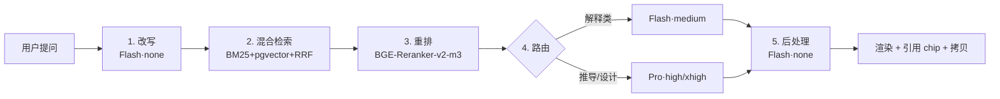

# 「小飞」前端工程交付包 v1.1 · Pro/Flash 路由器 + RAG + Markdown 契约 + 拷贝组件

<aside>
🧭

**本页定位：**承接 [「小飞」平台 · 阿里云技术实施与 Prompts Plan（《飞行原理》MVP 优先）](https://www.notion.so/Prompts-Plan-MVP-5186ca27435c4d1da269e5a81a288973?pvs=21)，把 v1.1 阶段四项前端核心能力沉淀为**可直接复制粘贴的代码片段**：①DeepSeek V4 Pro/Flash 路由器；②RAG×LLM 5 步编排；③Markdown/公式输出契约（system prompt + 前端管线）；④三层容器布局 + 拷贝回复组件。

**适用对象：**Claude Code / Cursor 编辑器中按 Phase 4 之后的 Prompt 套用。

</aside>

## 〇、v1.1 相对 v1.0 的关键变更

- **模型层**：弃用 `deepseek-chat` / `deepseek-reasoner` 旧别名，全量切换 `deepseek-v4-flash`（默认）+ `deepseek-v4-pro`（按需升档），利用 1M 上下文窗口删除"超 10 轮压缩"逻辑。
- **编排层**：明确 5 步流水线（改写 → 检索 → 重排 → 路由 → 后处理），所有步骤标注**任务 → 模型 → 思考强度**三元组。
- **输出层**：固化 Markdown 输出契约（公式、结构、引用、风格五维），修复 `L=12ρV2SCLL=21ρV2SCL` 这类双渲染 bug。
- **布局层**：三层容器架构 + Composer 吸底 + 滚动跟随 + 拷贝 action bar。

## 一、Pro/Flash 路由器

### 1.1 路由决策表

| 请求类型 | 模型 | 思考强度 | 触发条件 |
| --- | --- | --- | --- |
| 问题改写 / 检索预处理 | Flash | none | 始终 |
| Thread 自动起名 | Flash | none | 首条助手回复完成后 |
| 通用知识点讲解 | Flash | medium | 默认 |
| 推导 / 证明 / 计算 | Pro | high | 正则命中「推导/证明/为什么/计算/求解」 |
| 综合思考题 / 多步设计 | Pro | xhigh | 正则命中「思考题/综合/设计/分析」 |
| 用户手动「🧠 深度思考」 | Pro | high | UI Toggle |
| RAG 命中 ≥ 3 条 且为事实问答 | Flash | low | retriever 返回 hits ≥ 3 且 intent='fact' |
| JSON 修复 / 引用核验 | Flash | none | 始终（带 response_format: json_object） |

### 1.2 Python 实现（packages/ai/[router.py](http://router.py)）

```python
from dataclasses import dataclass
from enum import Enum
import re
from openai import OpenAI

client = OpenAI(
    api_key=os.environ["DEEPSEEK_API_KEY"],
    base_url="https://api.deepseek.com",   # 直连；接百炼时改为 dashscope 兼容地址
)

class Intent(str, Enum):
    REWRITE = "rewrite"
    TITLE = "title"
    EXPLAIN = "explain"
    DERIVE = "derive"
    DESIGN = "design"
    JSON_FIX = "json_fix"
    FACT_QA = "fact_qa"

@dataclass
class RouteDecision:
    model: str
    reasoning_effort: str   # none | low | medium | high | xhigh
    max_tokens: int
    response_format: dict | None = None

DERIVE_RE = re.compile(r"(推导|证明|为什么|怎么得到|求解|计算|公式来源)")
DESIGN_RE = re.compile(r"(思考题|综合|设计|分析|对比|方案)")

def classify_intent(user_msg: str, *, force_pro: bool = False, rag_hits: int = 0) -> Intent:
    if force_pro and DESIGN_RE.search(user_msg):
        return Intent.DESIGN
    if force_pro or DERIVE_RE.search(user_msg):
        return Intent.DERIVE
    if DESIGN_RE.search(user_msg):
        return Intent.DESIGN
    if rag_hits >= 3:
        return Intent.FACT_QA
    return Intent.EXPLAIN

def route(intent: Intent) -> RouteDecision:
    table = {
        Intent.REWRITE:  RouteDecision("deepseek-v4-flash", "none",   256),
        Intent.TITLE:    RouteDecision("deepseek-v4-flash", "none",   64),
        Intent.JSON_FIX: RouteDecision("deepseek-v4-flash", "none",   2000,
                                       {"type": "json_object"}),
        Intent.FACT_QA:  RouteDecision("deepseek-v4-flash", "low",    3000),
        Intent.EXPLAIN:  RouteDecision("deepseek-v4-flash", "medium", 4000),
        Intent.DERIVE:   RouteDecision("deepseek-v4-pro",   "high",   8000),
        Intent.DESIGN:   RouteDecision("deepseek-v4-pro",   "xhigh",  12000),
    }
    return table[intent]

def call(messages, intent: Intent, *, stream: bool = True):
    d = route(intent)
    return client.chat.completions.create(
        model=d.model,
        messages=messages,
        reasoning_effort=d.reasoning_effort,   # 字段名以你接入渠道为准
        max_tokens=d.max_tokens,
        stream=stream,
        response_format=d.response_format,
    )
```

### 1.3 前端「深度思考」开关（apps/web/components/composer/ThinkToggle.tsx）

```tsx
import { Brain } from "lucide-react";
import { useThreadStore } from "@/stores/thread";

export function ThinkToggle() {
  const { thinkMode, setThinkMode } = useThreadStore();
  return (
    <button
      type="button"
      role="switch"
      aria-checked={thinkMode}
      onClick={() => setThinkMode(!thinkMode)}
      className={`flex items-center gap-1.5 px-2.5 h-7 rounded-md text-sm transition
        ${thinkMode
          ? "bg-indigo-50 text-indigo-700 ring-1 ring-indigo-200"
          : "text-neutral-500 hover:bg-neutral-100"}`}
      title="切到 V4-Pro，约慢 3-5 秒，适合推导/计算"
    >
      <Brain size={14} />
      <span>深度思考</span>
    </button>
  );
}
```

## 二、RAG×LLM 5 步编排

### 2.1 数据流



### 2.2 端到端编排（packages/rag/[orchestrator.py](http://orchestrator.py)）

```python
from typing import AsyncGenerator
from .router import call, classify_intent, Intent, RouteDecision, route
from .retrieve import hybrid_search, rerank
from .prompts import SYSTEM_TUTOR, MARKDOWN_CONTRACT

async def answer(thread, user_msg: str, *, force_pro: bool = False
                 ) -> AsyncGenerator[dict, None]:
    # Step 1 · 改写（融合最近 3 轮对话）
    rewrite_msgs = [
        {"role": "system", "content":
         "将用户最新问题改写为自洽、检索友好的问题。仅输出问题，不要解释。"},
        *_recent_turns(thread, 3),
        {"role": "user", "content": user_msg},
    ]
    rewritten = (await call(rewrite_msgs, Intent.REWRITE, stream=False)
                 ).choices[0].message.content.strip()

    # Step 2 · 混合检索（BM25 + 向量 + RRF）
    candidates = await hybrid_search(rewritten, k=20,
                                     filters={"course_code": "B160031017"})

    # Step 3 · 重排取 Top 5
    top = await rerank(rewritten, candidates, top_k=5)

    # Step 4 · 路由 + 生成
    intent = classify_intent(user_msg, force_pro=force_pro, rag_hits=len(top))
    context_block = _render_context(top)
    gen_msgs = [
        {"role": "system", "content": SYSTEM_TUTOR + "\n\n" + MARKDOWN_CONTRACT},
        *_all_turns(thread),                              # 1M 窗口，直接全量
        {"role": "user", "content":
         f"<context>\n{context_block}\n</context>\n\n<question>\n{user_msg}\n</question>"},
    ]
    yield {"event": "route", "intent": intent.value, "model": route(intent).model}

    full_text = ""
    async for chunk in await call(gen_msgs, intent, stream=True):
        delta = chunk.choices[0].delta.content or ""
        full_text += delta
        yield {"event": "token", "delta": delta}

    # Step 5 · 后处理（校验公式 / 引用闭环 / Unicode 残留）
    cleaned, citations = _postprocess(full_text, top)
    yield {"event": "citations", "items": citations}
    yield {"event": "done", "content": cleaned}

def _render_context(chunks) -> str:
    return "\n\n".join(
        f"[{i+1}] (来源: {c.course_code} §{c.chapter}, p.{c.page})\n{c.text}"
        for i, c in enumerate(chunks)
    )
```

### 2.3 混合检索 + RRF（packages/rag/[retrieve.py](http://retrieve.py) 节选）

```python
from typing import Iterable

async def hybrid_search(q: str, k: int = 20, filters: dict = {}) -> list:
    dense  = await pgvector_search(q, k=k, filters=filters)   # 走 text-embedding-v3
    sparse = await bm25_search(q,    k=k, filters=filters)    # PostgreSQL tsvector
    return rrf(dense, sparse, k=k)

def rrf(*lists: Iterable, k: int = 60) -> list:
    """Reciprocal Rank Fusion (Cormack 2009)。"""
    scores: dict = {}
    for lst in lists:
        for rank, doc in enumerate(lst):
            scores[doc.id] = scores.get(doc.id, 0) + 1 / (k + rank)
    return sorted(scores.items(), key=lambda x: -x[1])

async def rerank(q: str, docs: list, top_k: int = 5) -> list:
    # 调用 BGE-Reranker-v2-m3（本地 1×T4 或阿里云 PAI-EAS）
    pairs = [(q, d.text) for d in docs]
    scores = await bge_reranker_api(pairs)
    return [d for d, _ in sorted(zip(docs, scores), key=lambda x: -x[1])[:top_k]]
```

## 三、Markdown 输出契约

### 3.1 写入 system prompt（packages/ai/prompts/markdown_[contract.py](http://contract.py)）

```python
MARKDOWN_CONTRACT = """
【输出格式契约 v1.1】

# 1. 公式
- 行内公式必须用 $...$，例如 $C_L$、$\\rho$。
- 独立公式必须用 $$...$$ 单独成行，前后空行。
- 禁止使用 Unicode 上下标 / 希腊字母替代字符（²、₂、½、ρ、α 等），一律使用 LaTeX 命令：^2、_2、\\frac{1}{2}、\\rho、\\alpha。
- 分数必须写 \\frac{a}{b}，不允许写 a/b 或 1/2 这种纯文本。
- 同一公式只输出一次，不要先用 LaTeX 写一遍再用纯文本重复。
- 单位用 \\text{} 包裹，如 $\\text{kg/m}^3$。

# 2. 结构（飞行原理类问题标准 7 段，按需取舍）
## 一句话定义
## 公式与符号（用 Markdown 表格列出符号/含义/单位/典型值）
## 物理直觉（callout 或加粗短句，≤ 5 行）
## 参数影响（按参数分小节，每段 ≤ 4 行）
## 工程应用（结合飞行场景，举 1 例）
## 思考题（1 道引导题 + 3-5 步引导 + 结论）
## 关联知识（课程内用 [[课程名 §章节]]，拓展用 [拓展]）

# 3. 引用
- 每条来自 <context> 的事实后必须用 [^1] [^2] 引用对应来源编号。
- 不允许编造 <context> 中不存在的引用编号。
- 文末不要重复列出来源（系统会自动生成参考资料区）。

# 4. 风格
- 不要寒暄开头（如「好的，同学」「很高兴你问到」）。
- 不要寒暄结尾（如「希望对你有帮助」「还有问题随时问」）。
- 不要单独的空粗体行 ** ；不要嵌套超过 2 级的列表。
- 主动语态、短句、信息密度高。

# 5. 表格与列表
- 符号表、参数对比强制用 Markdown 表格。
- 步骤性内容用有序列表，并列要点用无序列表。
"""
```

### 3.2 前端渲染管线（apps/web/components/Markdown.tsx）

```tsx
import ReactMarkdown from "react-markdown";
import remarkGfm from "remark-gfm";
import remarkMath from "remark-math";
import rehypeKatex from "rehype-katex";
import "katex/dist/katex.min.css";
import { useMemo } from "react";

export function Markdown({ children }: { children: string }) {
  // 渲染前清洗：剥离 raw LaTeX 与 KaTeX 输出并存的双渲染残留
  const cleaned = useMemo(() => sanitizeMath(children), [children]);
  return (
    <ReactMarkdown
      remarkPlugins={[remarkGfm, remarkMath]}
      rehypePlugins={[rehypeKatex]}
      components={{
        a: (props) => <a {...props} target="_blank" rel="noreferrer" />,
        table: (p) => <div className="overflow-x-auto"><table {...p} /></div>,
      }}
    >
      {cleaned}
    </ReactMarkdown>
  );
}

// 兜底清洗：把 Unicode 上下标 / 重复变量等模型偶发错误纠正
function sanitizeMath(md: string): string {
  return md
    .replace(/([A-Za-zρα-ωΩ])\1{1,3}(?=[^A-Za-z\\])/g, "$1")  // CLCL → CL
    .replace(/²/g, "^2").replace(/³/g, "^3")
    .replace(/½/g, "\\tfrac{1}{2}")
    .replace(/\$\s*\$/g, "");                                  // 空公式
}
```

## 四、三层容器布局

### 4.1 DOM 骨架（apps/web/app/thread/[id]/page.tsx）

```tsx
"use client";
import { useEffect, useLayoutEffect, useRef, useState } from "react";
import { Composer } from "@/components/composer/Composer";
import { MessageList } from "@/components/thread/MessageList";
import { Sidebar } from "@/components/thread/Sidebar";
import { TopBar } from "@/components/thread/TopBar";

export default function ThreadPage({ params }: { params: { id: string } }) {
  const scrollRef = useRef<HTMLDivElement>(null);
  const bottomRef = useRef<HTMLDivElement>(null);
  const [stickToBottom, setStickToBottom] = useState(true);
  const messages = useMessages(params.id);

  useLayoutEffect(() => {
    if (stickToBottom) bottomRef.current?.scrollIntoView({ block: "end" });
  }, [messages, stickToBottom]);

  function onScroll() {
    const el = scrollRef.current!;
    const distance = el.scrollHeight - el.scrollTop - el.clientHeight;
    setStickToBottom(distance < 40);
  }

  return (
    <div className="thread-page">
      <Sidebar />
      <main className="thread-main">
        <TopBar threadId={params.id} />
        <div className="thread-scroll" ref={scrollRef} onScroll={onScroll}>
          <div className="thread-messages">
            <MessageList messages={messages} />
            <div ref={bottomRef} />
          </div>
          {!stickToBottom && (
            <button className="jump-to-latest"
              onClick={() => { setStickToBottom(true);
                               bottomRef.current?.scrollIntoView({ behavior: "smooth" }); }}>
              ↓ 跳到最新
            </button>
          )}
        </div>
        <footer className="thread-composer-wrap">
          <Composer mode="thread" threadId={params.id} />
        </footer>
      </main>
    </div>
  );
}
```

### 4.2 CSS（apps/web/styles/thread.css）

```css
/* —— 全局：禁用 body 滚动，把滚动权交给内部容器 —— */
html, body, #__next { height: 100%; margin: 0; overflow: hidden; }

.thread-page {
  display: flex;
  height: 100vh;
  height: 100dvh;          /* 移动端用 dvh 防键盘顶飞 */
}

.thread-main {
  flex: 1;
  display: flex;
  flex-direction: column;
  min-width: 0;
  min-height: 0;
}

.thread-topbar { flex-shrink: 0; height: 48px; border-bottom: 1px solid #EDEDEC; }

.thread-scroll {
  flex: 1 1 auto;
  min-height: 0;           /* ← 最易遗漏的一条：flex child 默认 auto 会撑爆 */
  overflow-y: auto;
  overflow-x: hidden;
  scrollbar-gutter: stable;
  position: relative;
}
.thread-scroll::-webkit-scrollbar { width: 10px; }
.thread-scroll::-webkit-scrollbar-thumb {
  background: #D3D3D1; border-radius: 8px; border: 2px solid #fff;
}
.thread-scroll::-webkit-scrollbar-thumb:hover { background: #B5B5B3; }

.thread-messages { max-width: 720px; margin: 0 auto; padding: 32px 24px 24px; }

.thread-composer-wrap {
  flex-shrink: 0;
  border-top: 1px solid #EDEDEC;
  background: #fff;
  box-shadow: 0 -8px 24px -16px rgba(0,0,0,0.08);
  padding: 12px 0 16px;
}

/* 长公式与代码块溢出保护 */
.thread-messages :is(pre, code, .katex-display) { max-width: 100%; overflow-x: auto; }
.thread-messages .katex-display { padding: 8px 0; }
.thread-messages * { word-break: break-word; overflow-wrap: anywhere; }

.jump-to-latest {
  position: absolute; right: 24px; bottom: 24px;
  padding: 6px 12px; border-radius: 999px;
  background: #fff; border: 1px solid #E3E2E0;
  box-shadow: 0 4px 12px rgba(15,15,15,0.08);
  font-size: 13px; cursor: pointer;
}
```

## 五、Composer（首页 hero 与对话页共享同组件）

### 5.1 组件（apps/web/components/composer/Composer.tsx）

```tsx
"use client";
import { useRef, useState, KeyboardEvent } from "react";
import { Send, AtSign, Slash, Paperclip } from "lucide-react";
import { ThinkToggle } from "./ThinkToggle";
import { useThreadStore } from "@/stores/thread";
import { motion } from "framer-motion";

type Props = { mode: "hero" | "thread"; threadId?: string };

export function Composer({ mode, threadId }: Props) {
  const [value, setValue] = useState("");
  const ref = useRef<HTMLTextAreaElement>(null);
  const submit = useThreadStore((s) => s.submit);

  function onKey(e: KeyboardEvent<HTMLTextAreaElement>) {
    if (e.key === "Enter" && !e.shiftKey) {
      e.preventDefault();
      doSubmit();
    }
  }
  async function doSubmit() {
    const text = value.trim();
    if (!text) return;
    setValue("");
    await submit({ text, threadId });   // 内部：mode==='hero' 时创建新 thread 并 router.push
    ref.current?.focus();               // 不失焦，便于追问
  }

  return (
    <motion.div layoutId="composer"
      className={`composer ${mode === "hero" ? "composer--hero" : "composer--thread"}`}>
      <textarea
        ref={ref}
        value={value}
        onChange={(e) => setValue(e.target.value)}
        onKeyDown={onKey}
        placeholder={mode === "hero"
          ? "小飞，今天想精进哪个知识点？"
          : "继续提问…（Shift+Enter 换行）"}
        rows={mode === "hero" ? 3 : 2}
        className="composer__input"
      />
      <div className="composer__toolbar">
        <button type="button" title="@ 引用页面/知识点" className="icon-btn"><AtSign size={16}/></button>
        <button type="button" title="/ 命令" className="icon-btn"><Slash size={16}/></button>
        <button type="button" title="附件" className="icon-btn"><Paperclip size={16}/></button>
        <div className="flex-1" />
        <ThinkToggle />
        <button onClick={doSubmit} disabled={!value.trim()} className="send-btn">
          <Send size={16}/>
        </button>
      </div>
    </motion.div>
  );
}
```

### 5.2 Composer CSS（apps/web/styles/composer.css）

```css
.composer {
  position: relative;
  background: #fff;
  border: 1px solid #E3E2E0;
  border-radius: 12px;
  box-shadow: 0 1px 2px rgba(15,15,15,0.06), 0 4px 12px rgba(15,15,15,0.04);
  transition: border-color 120ms, box-shadow 120ms;
}
.composer:focus-within {
  border-color: #37352F33;
  box-shadow: 0 1px 2px rgba(15,15,15,0.08), 0 8px 24px rgba(15,15,15,0.06);
}

.composer--hero   { width: 720px; min-height: 96px;  margin: 0 auto; }
.composer--thread { width: 720px; min-height: 64px;  max-width: calc(100vw - 48px); margin: 0 auto; }

.composer__input {
  display: block;
  width: 100%;
  border: 0;
  outline: 0;
  resize: none;
  padding: 16px 20px 8px;
  font-size: 16px;
  line-height: 1.6;
  background: transparent;
  font-family: inherit;
  max-height: 240px;
  overflow-y: auto;
}
.composer__input::placeholder { color: #B5B5B3; }

.composer__toolbar {
  display: flex; align-items: center; gap: 4px;
  padding: 6px 10px 10px;
}
.composer .icon-btn {
  width: 28px; height: 28px; display: inline-flex; align-items: center; justify-content: center;
  border-radius: 6px; color: #6B6B6A; background: transparent; border: 0; cursor: pointer;
}
.composer .icon-btn:hover { background: #F7F7F5; color: #37352F; }
.composer .flex-1 { flex: 1; }
.composer .send-btn {
  width: 28px; height: 28px; border-radius: 999px;
  background: #37352F; color: #fff; border: 0; cursor: pointer;
  display: inline-flex; align-items: center; justify-content: center;
}
.composer .send-btn:disabled { background: #D3D3D1; cursor: not-allowed; }
```

## 六、拷贝回复组件

### 6.1 工具函数（apps/web/lib/clipboard.ts）

```tsx
import { renderToStaticMarkup } from "react-dom/server";
import { Markdown } from "@/components/Markdown";
import { remark } from "remark";
import strip from "strip-markdown";

export type CopyFormat = "md" | "rich" | "plain";

export async function copyMessage(content: string, format: CopyFormat) {
  if (format === "md") {
    await navigator.clipboard.writeText(content);
    return;
  }
  if (format === "plain") {
    await navigator.clipboard.writeText(stripToPlain(content));
    return;
  }
  // rich: 同时写入 HTML 与 plain 两种 MIME
  const html = renderToStaticMarkup(<Markdown>{content}</Markdown>);
  const plain = stripToPlain(content);
  await navigator.clipboard.write([
    new ClipboardItem({
      "text/html":  new Blob([html],  { type: "text/html"  }),
      "text/plain": new Blob([plain], { type: "text/plain" }),
    }),
  ]);
}

export function stripToPlain(md: string): string {
  const readable = md
    .replace(/\$\$([\s\S]+?)\$\$/g, (_, eq) => `\n${latexToReadable(eq)}\n`)
    .replace(/\$([^$\n]+?)\$/g,     (_, eq) => latexToReadable(eq));
  return String(remark().use(strip).processSync(readable)).trim();
}

function latexToReadable(s: string): string {
  return s
    .replace(/\\tfrac\{([^}]+)\}\{([^}]+)\}/g, "($1)/($2)")
    .replace(/\\frac\{([^}]+)\}\{([^}]+)\}/g,  "($1)/($2)")
    .replace(/\\rho/g, "ρ").replace(/\\alpha/g, "α")
    .replace(/\\beta/g, "β").replace(/\\theta/g, "θ")
    .replace(/\\cdot/g, "·").replace(/\\times/g, "×")
    .replace(/\\text\{([^}]+)\}/g, "$1")
    .replace(/\^(\d)/g, (_, d) => "⁰¹²³⁴⁵⁶⁷⁸⁹"[+d])
    .replace(/_(\d)/g,  (_, d) => "₀₁₂₃₄₅₆₇₈₉"[+d])
    .replace(/\\[a-zA-Z]+/g, "")
    .replace(/[{}]/g, "");
}
```

### 6.2 Action Bar（apps/web/components/thread/MessageActions.tsx）

```tsx
"use client";
import { useState } from "react";
import { Copy, Check, ChevronDown, RefreshCw, ThumbsUp, ThumbsDown, Quote } from "lucide-react";
import { copyMessage, CopyFormat } from "@/lib/clipboard";
import { toast } from "sonner";

export function MessageActions({
  content, onRetry, onRate, onQuote,
}: {
  content: string;
  onRetry: () => void;
  onRate: (v: 1 | -1) => void;
  onQuote: () => void;
}) {
  const [copied, setCopied] = useState<CopyFormat | null>(null);
  const [open, setOpen]     = useState(false);

  async function doCopy(fmt: CopyFormat) {
    try {
      await copyMessage(content, fmt);
      setCopied(fmt);
      toast.success(
        `已复制（${fmt === "md" ? "Markdown" : fmt === "plain" ? "纯文本" : "富文本"}）`,
      );
      setTimeout(() => setCopied(null), 1500);
      setOpen(false);
    } catch {
      toast.error("复制失败，请检查浏览器剪贴板权限");
    }
  }

  return (
    <div className="msg-actions" role="toolbar" aria-label="消息操作">
      <button title="复制（Markdown）" onClick={() => doCopy("md")} className="icon-btn">
        {copied === "md" ? <Check size={14}/> : <Copy size={14}/>}
      </button>
      <div className="dropdown">
        <button title="更多复制选项" onClick={() => setOpen((v) => !v)} className="icon-btn">
          <ChevronDown size={14}/>
        </button>
        {open && (
          <ul className="dropdown-menu" onMouseLeave={() => setOpen(false)}>
            <li onClick={() => doCopy("md")}>📋 复制为 Markdown（含 LaTeX）</li>
            <li onClick={() => doCopy("rich")}>🎨 复制为富文本（粘到 Notion / Word）</li>
            <li onClick={() => doCopy("plain")}>📝 复制为纯文本</li>
          </ul>
        )}
      </div>
      <span className="divider" />
      <button title="重新生成" onClick={onRetry} className="icon-btn"><RefreshCw size={14}/></button>
      <button title="👍 有帮助" onClick={() => onRate(1)}  className="icon-btn"><ThumbsUp size={14}/></button>
      <button title="👎 有问题" onClick={() => onRate(-1)} className="icon-btn"><ThumbsDown size={14}/></button>
      <button title="作为新提问引用" onClick={onQuote} className="icon-btn"><Quote size={14}/></button>
    </div>
  );
}
```

### 6.3 Action Bar CSS（apps/web/styles/message-actions.css）

```css
.assistant-message { position: relative; padding-bottom: 36px; }
.assistant-message .msg-actions {
  position: absolute; left: 0; bottom: 0;
  display: flex; align-items: center; gap: 2px;
  padding: 4px; background: #fff;
  border: 1px solid #EDEDEC; border-radius: 8px;
  box-shadow: 0 2px 8px rgba(15,15,15,0.06);
  opacity: 0; transform: translateY(-4px);
  transition: opacity 120ms, transform 120ms;
  pointer-events: none;
}
.assistant-message:hover .msg-actions,
.assistant-message:focus-within .msg-actions {
  opacity: 1; transform: translateY(0); pointer-events: auto;
}
.msg-actions .icon-btn {
  width: 28px; height: 28px; border-radius: 6px;
  display: inline-flex; align-items: center; justify-content: center;
  color: #6B6B6A; background: transparent; border: 0; cursor: pointer;
}
.msg-actions .icon-btn:hover { background: #F7F7F5; color: #37352F; }
.msg-actions .divider { width: 1px; height: 16px; background: #EDEDEC; margin: 0 2px; }
.msg-actions .dropdown { position: relative; }
.msg-actions .dropdown-menu {
  position: absolute; top: 32px; left: 0; z-index: 30;
  min-width: 220px; padding: 4px; margin: 0;
  list-style: none; background: #fff;
  border: 1px solid #EDEDEC; border-radius: 8px;
  box-shadow: 0 8px 24px rgba(15,15,15,0.10);
  font-size: 13px;
}
.msg-actions .dropdown-menu li {
  padding: 8px 10px; border-radius: 6px; cursor: pointer;
}
.msg-actions .dropdown-menu li:hover { background: #F7F7F5; }
```

### 6.4 全局快捷键（apps/web/components/thread/CopyHotkey.tsx）

```tsx
"use client";
import { useEffect } from "react";
import { useThreadStore } from "@/stores/thread";
import { copyMessage } from "@/lib/clipboard";
import { toast } from "sonner";

export function CopyHotkey() {
  const messages = useThreadStore((s) => s.currentMessages);
  useEffect(() => {
    function handler(e: KeyboardEvent) {
      if ((e.metaKey || e.ctrlKey) && e.shiftKey && e.key.toLowerCase() === "c") {
        const last = [...messages].reverse().find((m) => m.role === "assistant");
        if (!last) return;
        copyMessage(last.content, "md");
        toast.success("已复制最近一条回复");
        e.preventDefault();
      }
    }
    window.addEventListener("keydown", handler);
    return () => window.removeEventListener("keydown", handler);
  }, [messages]);
  return null;
}
```

## 七、首页 Hero（含 chips 在输入框上方）

```tsx
// apps/web/app/page.tsx
import { Composer } from "@/components/composer/Composer";
import { RecentList } from "@/components/home/RecentList";

const SUGGESTIONS = [
  "升力公式详解",
  "伯努利原理在飞行中的应用",
  "失速的识别与改出",
  "襟翼的作用和使用场景",
];

export default function HomePage() {
  return (
    <div className="home-hero">
      
      <h1>小飞，今天想精进哪个知识点？</h1>
      <p className="subtitle">飞行学员的 24 小时智能学习助手</p>
      <div className="suggestion-chips">
        {SUGGESTIONS.map((s) => (
          <button key={s} className="chip" onClick={() => fillComposer(s)}>{s}</button>
        ))}
      </div>
      <Composer mode="hero" />
      <RecentList limit={3} />
    </div>
  );
}
```

```css
/* apps/web/styles/home.css */
.home-hero { width: 720px; margin: 0 auto; padding-top: 18vh; text-align: center; }
.home-logo { width: 56px; height: 56px; margin-bottom: 16px; }
.home-hero h1 { font-size: 28px; font-weight: 600; color: #37352F; margin: 0 0 8px; }
.home-hero .subtitle { color: #6B6B6A; margin: 0 0 24px; }
.suggestion-chips {
  display: flex; flex-wrap: wrap; gap: 8px; justify-content: center; margin-bottom: 16px;
}
.chip {
  padding: 6px 14px; border-radius: 999px; font-size: 13px;
  background: #F7F7F5; color: #37352F; border: 1px solid #EDEDEC;
  cursor: pointer; transition: background 120ms;
}
.chip:hover { background: #EFEFEC; }
```

## 八、依赖清单（pnpm add）

```bash
pnpm add react-markdown remark-gfm remark-math rehype-katex katex
pnpm add framer-motion lucide-react sonner zustand
pnpm add strip-markdown remark
pnpm add openai                # DeepSeek 走 OpenAI 兼容协议
# 后端
pip install openai sqlalchemy psycopg pgvector
# RAG 重排（任选一）
pip install FlagEmbedding      # 本地跑 BGE-Reranker
# 或调用云端 API（阿里云 gte-rerank-v2 / 自建 vLLM）
```

## 九、验收 Checklist（v1.1 出包标准）

- [ ]  **P0** 首页 Hero 720×96 大输入框，chips 在输入框**上方**
- [ ]  **P0** `/thread/[id]` 路由独立，提交后秒切页面
- [ ]  **P0** `html, body { overflow:hidden }`，`.thread-scroll` 是唯一滚动容器（含 `min-height:0`）
- [ ]  **P0** Composer 是 `<main>` 的 flex 子项 + `flex-shrink:0`，无 `position:fixed`
- [ ]  **P0** Markdown 管线只保留 `remark-math → rehype-katex` 一条链路
- [ ]  **P0** 模型配置已切到 `deepseek-v4-flash` / `deepseek-v4-pro`
- [ ]  **P1** Pro/Flash 路由器 + 「🧠 深度思考」开关
- [ ]  **P1** RAG 5 步编排：改写 → 混合检索 → BGE 重排 → 路由 → 后处理
- [ ]  **P1** system prompt 含完整 Markdown 输出契约
- [ ]  **P1** `[^n]` 引用 chip 可点击
- [ ]  **P2** Hover Action Bar：拷贝（默认 MD）+ 二级菜单（MD/富文本/纯文本）+ 重试/评分/引用
- [ ]  **P2** `⌘/Ctrl + Shift + C` 拷贝最近回复
- [ ]  **P2** `stickToBottom` 跟随 + 「↓ 跳到最新」浮标
- [ ]  **P2** 长公式/代码块溢出保护
- [ ]  **P3** 移动端：`100dvh` + `env(safe-area-inset-bottom)`

## 十、来源核验声明

- **DeepSeek V4 双档（Pro 1.6T/49B、Flash 284B/13B、1M 上下文、`reasoning_effort` 字段）**：核实自 DeepSeek 官方 API 文档（[api-docs.deepseek.com/news/news260424）、HuggingFace](http://api-docs.deepseek.com/news/news260424）、HuggingFace) 模型卡（[huggingface.co/deepseek-ai/DeepSeek-V4-Pro）、OpenRouter](http://huggingface.co/deepseek-ai/DeepSeek-V4-Pro）、OpenRouter) 与 Together AI 模型页。**API 字段精确命名以你实际接入渠道的文档为准**。
- **RRF（Reciprocal Rank Fusion）**：Cormack et al., SIGIR 2009 论文 *"Reciprocal Rank Fusion outperforms Condorcet and individual Rank Learning Methods"*。
- **BGE-Reranker-v2-m3**：BAAI 开源，仓库 `BAAI/bge-reranker-v2-m3`，可在 HuggingFace 与 GitHub 核验。
- **KaTeX / remark-math / rehype-katex 管线顺序**：unified.js 生态规范，两库 README 明确要求 `remark-math` 在 `rehype-katex` 之前。
- **`min-height: 0` 解决 flex 滚动撑爆 / `100dvh` 防移动端键盘顶飞**：CSS 规范行为，可在 MDN 对应条目核验。
- **Notion AI 的 UI 形态（720 px 输入框、文档流回答、hover action bar、`⌘+Shift+C`）**：基于对当前产品形态的观察归纳，**无官方设计规范公开链接**，作为风格参考非硬性 API。
- **W3C Clipboard API（`navigator.clipboard.write` + `ClipboardItem` 多 MIME）**：W3C 规范，主流浏览器自 2022 年支持。

<aside>
🚀

**下一步建议：**先把 §四「三层容器布局」与 §三「Markdown 输出契约」两块落到代码里，它们能修复你截图中最严重的两类 bug（吸底失效 + 公式双渲染）。其余模块（路由器、拷贝组件）可作为本周迭代项并行推进。

</aside>