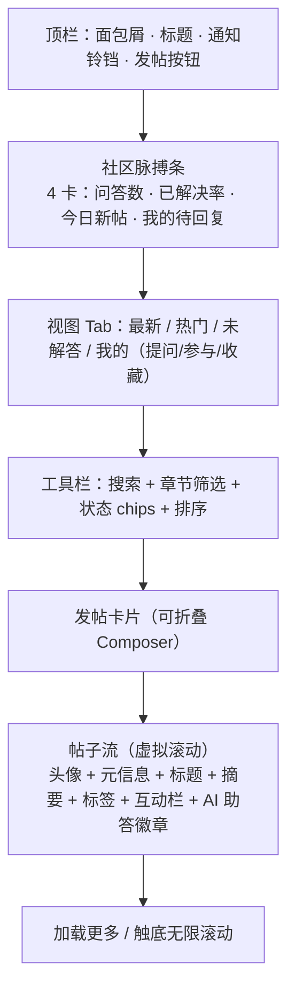

<aside>
💬

**本页定位：**作为「小飞」前端工程交付包 v1.1 · Pro/Flash 路由器 + RAG + Markdown 契约 + 拷贝组件的第三个扩展模块，规范「小飞」**讨论社区页**（`/community/[course_code]`）的视觉设计、信息架构、交互行为与可复制实现。本页比题库 / 资料页多一层「**AI 助答 + RAG 联动**」业务，由此关联到父包 §一（Pro/Flash 路由器）与 §二（RAG 5 步）。

**适用范围：**社区首页（截图所示）。帖子详情、举报、管理后台另起规范。

**与前两页的关系：**`.main` 三层容器、深色主题 token、滚动修复**完全继承**；新增组件聚焦「贴文流 + 编辑器 + AI 摘要徽章」。

</aside>

## 〇、问题清单（重设计依据）

基于截图与前两页同源问题，定位 10 个必修点：

| # | 问题 | 后果 | P |
| --- | --- | --- | --- |
| 1 | 背景纯白 vs 左侧深色 | 视觉断裂，同前两页同根 | P0 |
| 2 | 无滚动条 | 帖子超过 5 条后看不到后面 | P0 |
| 3 | 发帖表单常驻顶部 + 占两屏一半 | 浏览动线被打断，刷帖体验差 | P1 |
| 4 | 没有筛选 / 排序（最新/热门/未解答/我的） | 翻不到关心的内容 | P1 |
| 5 | 帖子只显示章节码、标题、回复数、浏览数 | 缺少作者头像、标签、点赞、最佳回答徽章 | P1 |
| 6 | 没有 AI 自动给出参考答案 / 引用 PPT 页码 | 把小飞最大优势丢掉了 | P1 |
| 7 | 没有搜索框 | 不能复用已有问答 | P2 |
| 8 | 章节码（081-03）展示但不可点 | 不能跳回章节复习 | P2 |
| 9 | 没有举报 / 收藏 / 关注 动作 | 社区治理与个人沉淀能力为零 | P2 |
| 10 | 没有「我的提问 / 待回复 / 通知」入口 | 用户回访动线缺失 | P2 |

---

## 一、信息架构



### 与前两页的对照

| 维度 | 题库页 | 资料页 | 社区页（本页） |
| --- | --- | --- | --- |
| 顶部条 | 学情 KPI | 资源概览 | **社区脉搏**（问答/解决率/新帖/待回） |
| 主类型切换 | 模式卡片 | 类型 Tab | **视图 Tab**（最新/热门/未解答/我的） |
| 主筛选 | 难度/状态 chips | 主题 tag chips | **章节 + 状态** chips |
| 主输入 | 章节列表 + CTA | 无（动作走卡内） | **Composer 卡片**（折叠态/展开态） |
| 主流 | 章节列 | 资源卡片网格 | **帖子卡片纵向流** |
| 差异化亮点 | — | 视频接口预留 | **AI 助答徽章**  • RAG 引用 |

---

## 二、设计 Token

复用题库 UI 规范 §二 的 surface / border / text / accent / success / danger 全套。新增**状态徽章色**与**AI 标识色**：

| Token | 值 | 用途 |
| --- | --- | --- |
| `--badge-open` | `#F59E0B` | 「待回答」橙 |
| `--badge-open-bg` | `rgba(245,158,11,0.14)` | 同上背景 |
| `--badge-solved` | `#34D399` | 「已解决」绿 |
| `--badge-solved-bg` | `rgba(52,211,153,0.14)` | 同上背景 |
| `--badge-hot` | `#F87171` | 「热门」红 |
| `--badge-hot-bg` | `rgba(248,113,113,0.14)` | 同上背景 |
| `--ai-accent` | `#22D3EE` | AI 助答徽章主色（与视频 token 同色，但语义独立） |
| `--ai-accent-bg` | `linear-gradient(135deg, rgba(34,211,238,.18), rgba(155,134,255,.18))` | AI 徽章渐变底 |

---

## 三、滚动架构（P0 · 与前两页同根）

直接复用题库页 §三 完整 CSS，无任何变更。**两行决定一切**：

```css
.main      { display: flex; flex-direction: column; min-height: 0; }
.main-scroll { flex: 1; overflow-y: auto; min-height: 0; }
```

---

## 四、页面 TSX 骨架

```tsx
// apps/web/app/community/[code]/page.tsx
import { PulseStrip } from '@/components/community/PulseStrip'
import { ViewTabs } from '@/components/community/ViewTabs'
import { CommunityToolbar } from '@/components/community/CommunityToolbar'
import { Composer } from '@/components/community/Composer'
import { PostFeed } from '@/components/community/PostFeed'
import { Breadcrumbs } from '@/components/shared/Breadcrumbs'
import { Bell } from 'lucide-react'

export default function CommunityPage({ params }: { params: { code: string } }) {
	return (
		<div className="main">
			<header className="main-header">
				<Breadcrumbs items={[
					{ label: '课程中心', href: '/courses' },
					{ label: '飞行原理', href: `/courses/${params.code}` },
					{ label: '讨论社区' },
				]}/>
				<div className="page-title-row">
					<h1 className="page-title">讨论社区</h1>
					<NotificationBell />
				</div>
				<p className="page-sub">围绕章节、题目和课件发起讨论，适合课后答疑与学习笔记沉淀。</p>
			</header>

			<div className="main-scroll">
				<PulseStrip courseCode={params.code} />        {/* Block 1 */}
				<ViewTabs />                                    {/* Block 2 */}
				<CommunityToolbar courseCode={params.code} />   {/* Block 3 */}
				<Composer courseCode={params.code} />           {/* Block 4 */}
				<PostFeed courseCode={params.code} />           {/* Block 5 */}
			</div>
		</div>
	)
}
```

---

## 五、Block 1 · 社区脉搏条

### TSX

```tsx
// components/community/PulseStrip.tsx
import { useQuery } from '@tanstack/react-query'
import { MessageSquare, CheckCircle2, Sparkles, Inbox } from 'lucide-react'

export function PulseStrip({ courseCode }: { courseCode: string }) {
	const { data } = useQuery({
		queryKey: ['community', 'pulse', courseCode],
		queryFn: () => fetch(`/api/community/${courseCode}/pulse`).then(r => r.json()),
	})

	const items = [
		{ icon: MessageSquare, label: '总问答',     value: data?.totalPosts  ?? '—' },
		{ icon: CheckCircle2,  label: '已解决率',   value: data ? `${data.solvedRate}%` : '—', tint: 'solved' },
		{ icon: Sparkles,      label: '今日新帖',   value: data?.todayNew    ?? '—' },
		{ icon: Inbox,         label: '我的待回复', value: data?.myPending   ?? '—', tint: data?.myPending > 0 ? 'open' : undefined },
	]

	return (
		<div className="overview-strip">
			{items.map(it => (
				<div key={it.label} className="ov-card">
					<div className={`ov-icon ${it.tint ? `tint-${it.tint}` : ''}`}><it.icon size={18}/></div>
					<div className="ov-text">
						<div className="ov-label">{it.label}</div>
						<div className="ov-value">{it.value}</div>
					</div>
				</div>
			))}
		</div>
	)
}
```

### CSS（增量）

```css
/* 复用题库/资料页 .overview-strip / .ov-card / .ov-icon，新增 tint */
.ov-icon.tint-open   { background: var(--badge-open-bg);   color: var(--badge-open); }
.ov-icon.tint-solved { background: var(--badge-solved-bg); color: var(--badge-solved); }
.ov-icon.tint-hot    { background: var(--badge-hot-bg);    color: var(--badge-hot); }
```

---

## 六、Block 2 · 视图 Tab

### TSX

```tsx
// components/community/ViewTabs.tsx
import { useCommunityStore } from '@/stores/community'
import { Clock, Flame, HelpCircle, User } from 'lucide-react'

const VIEWS = [
	{ id: 'latest',   icon: Clock,      label: '最新' },
	{ id: 'hot',      icon: Flame,      label: '热门' },
	{ id: 'unsolved', icon: HelpCircle, label: '未解答' },
	{ id: 'mine',     icon: User,       label: '我的' },
] as const

export function ViewTabs() {
	const { view, setView } = useCommunityStore()
	return (
		<nav className="type-tabs" role="tablist">
			{VIEWS.map(v => {
				const active = view === v.id
				return (
					<button
						key={v.id}
						role="tab"
						aria-selected={active}
						className={`type-tab ${active ? 'is-active' : ''}`}
						onClick={() => setView(v.id)}
					>
						<v.icon size={16}/>
						<span>{v.label}</span>
					</button>
				)
			})}
		</nav>
	)
}
```

复用资料页 §六 `.type-tabs` 全部样式。当 `view='mine'` 时，feed 后端进一步分 `我的提问 / 我参与的 / 我收藏` 三个子 Tab；详见 §七。

---

## 七、Block 3 · 工具栏

### TSX

```tsx
// components/community/CommunityToolbar.tsx
import { useCommunityStore } from '@/stores/community'
import { useQuery } from '@tanstack/react-query'
import { Search } from 'lucide-react'

export function CommunityToolbar({ courseCode }: { courseCode: string }) {
	const { query, setQuery, chapter, setChapter, statusFilters, toggleStatus, sort, setSort, view } = useCommunityStore()

	const { data: chapters = [] } = useQuery<{ code: string; title: string }[]>({
		queryKey: ['community', 'chapters', courseCode],
		queryFn: () => fetch(`/api/community/${courseCode}/chapters`).then(r => r.json()),
	})

	return (
		<div className="toolbar-row community-toolbar">
			<div className="toolbar-search">
				<Search size={16}/>
				<input
					value={query}
					onChange={e => setQuery(e.target.value)}
					placeholder="搜索问题、章节、关键词或题号..."
				/>
			</div>

			<div className="toolbar-chips">
				<button
					className={`mt-chip ${!chapter ? 'is-active' : ''}`}
					onClick={() => setChapter(null)}
				>全部章节</button>
				{chapters.map(c => (
					<button
						key={c.code}
						className={`mt-chip ${chapter === c.code ? 'is-active' : ''}`}
						onClick={() => setChapter(c.code)}
						title={c.title}
					>{c.code}</button>
				))}
			</div>

			<div className="toolbar-right">
				<div className="status-chip-row">
					{(['未解答','已解决','有 AI 答案'] as const).map(s => (
						<button
							key={s}
							className={`mt-chip status-chip ${statusFilters.includes(s) ? 'is-active' : ''}`}
							onClick={() => toggleStatus(s)}
						>{s}</button>
					))}
				</div>
				<select className="sort-select" value={sort} onChange={e => setSort(e.target.value as any)}>
					<option value="latest">最新</option>
					<option value="replies">回复多</option>
					<option value="views">浏览多</option>
					<option value="votes">点赞多</option>
				</select>
			</div>
		</div>
	)
}
```

### CSS（增量，多数复用资料页 §七）

```css
.community-toolbar { grid-template-columns: 320px 1fr auto; }
.status-chip-row { display: inline-flex; gap: 6px; margin-right: 8px; }
.status-chip.is-active { background: var(--accent-bg); border-color: var(--accent); color: var(--accent); }
```

---

## 八、Block 4 · Composer 折叠卡片（**核心 UX 改进**）

### 行为规约

1. **默认折叠态**：单行 placeholder「发起一个飞行原理问题…」，左侧用户头像，右侧 `📎附件 🖼️图片 🎯关联题号`。**总高度 56px**。
2. **聚焦展开**：点击 placeholder → 展开为标题输入 + 富文本编辑器 + 关联章节下拉 + 关联题号 + 标签 chips + AI 预答开关 + 发布 / 暂存草稿 / 取消。
3. **发布前 AI 预答**：开关默认开启。提交时先调 `/api/community/preview-ai-answer`，把回答附在帖子下作为 `ai_answer` 字段；同时展示「✨ 小飞的初步答案」徽章。
4. **关联题号联动**：粘贴形如 `081-03/Q42` 的题号 → 自动展开「引用题目」预览卡。
5. **草稿持久化**：localStorage `community:draft:${courseCode}` 5 秒节流写入，重启浏览器仍可恢复。

### TSX

```tsx
// components/community/Composer.tsx
import { useState, useEffect } from 'react'
import { Paperclip, Image, Hash, Sparkles, Send, FileText } from 'lucide-react'
import { useCurrentUser } from '@/hooks/useCurrentUser'
import { useLocalDraft } from '@/hooks/useLocalDraft'
import { useMutation } from '@tanstack/react-query'

export function Composer({ courseCode }: { courseCode: string }) {
	const me = useCurrentUser()
	const [expanded, setExpanded] = useState(false)
	const [draft, setDraft] = useLocalDraft(`community:draft:${courseCode}`, {
		title: '', body: '', chapterCode: '', questionId: '', tags: [] as string[], wantAiAnswer: true,
	})

	const submit = useMutation({
		mutationFn: () => fetch(`/api/community/${courseCode}/posts`, {
			method: 'POST',
			headers: { 'content-type': 'application/json' },
			body: JSON.stringify(draft),
		}).then(r => r.json()),
		onSuccess: () => {
			setDraft({ title: '', body: '', chapterCode: '', questionId: '', tags: [], wantAiAnswer: true })
			setExpanded(false)
		},
	})

	if (!expanded) {
		return (
			<div className="composer composer-collapsed" onClick={() => setExpanded(true)} role="button" tabIndex={0}>
				
				<span className="composer-placeholder">发起一个飞行原理问题…</span>
				<div className="composer-quick">
					<button className="btn-icon" aria-label="附件"><Paperclip size={16}/></button>
					<button className="btn-icon" aria-label="图片"><Image size={16}/></button>
					<button className="btn-icon" aria-label="关联题号"><Hash size={16}/></button>
				</div>
			</div>
		)
	}

	return (
		<div className="composer composer-expanded">
			<div className="composer-head">
				
				<span className="composer-name">{me.name} · 提问中</span>
			</div>

			<input
				className="composer-title"
				value={draft.title}
				onChange={e => setDraft({ ...draft, title: e.target.value })}
				placeholder="标题，例如：临界攻角和失速速度的关系"
				maxLength={120}
			/>
			<textarea
				className="composer-body"
				value={draft.body}
				onChange={e => setDraft({ ...draft, body: e.target.value })}
				placeholder="写下你的思路、疑问或题目来源。支持 Markdown 与 $LaTeX$"
				rows={6}
			/>

			<div className="composer-meta-row">
				<ChapterSelect courseCode={courseCode} value={draft.chapterCode} onChange={v => setDraft({ ...draft, chapterCode: v })}/>
				<input
					className="composer-qref"
					placeholder="关联题号 (可选)，如 081-03/Q42"
					value={draft.questionId}
					onChange={e => setDraft({ ...draft, questionId: e.target.value })}
				/>
				<TagChipPicker value={draft.tags} onChange={tags => setDraft({ ...draft, tags })}/>
			</div>

			<label className="composer-ai-toggle">
				<input
					type="checkbox"
					checked={draft.wantAiAnswer}
					onChange={e => setDraft({ ...draft, wantAiAnswer: e.target.checked })}
				/>
				<Sparkles size={14}/>
				<span>发布时让小飞先给一个参考答案（约 2 秒）</span>
			</label>

			<div className="composer-footer">
				<div className="composer-tools">
					<button className="btn-icon"><Paperclip size={16}/></button>
					<button className="btn-icon"><Image size={16}/></button>
					<button className="btn-icon"><FileText size={16}/></button>
				</div>
				<div className="composer-actions">
					<button className="btn-ghost" onClick={() => setExpanded(false)}>取消</button>
					<button
						className="btn-primary"
						disabled={!draft.title.trim() || !draft.body.trim() || submit.isPending}
						onClick={() => submit.mutate()}
					>
						<Send size={14}/>{submit.isPending ? '发布中…' : '发布'}
					</button>
				</div>
			</div>
		</div>
	)
}
```

### CSS

```css
.composer {
	background: var(--surface-1);
	border: 1px solid var(--border);
	border-radius: 14px;
	margin-bottom: 20px;
	transition: border-color .15s;
}
.composer:hover { border-color: rgba(155,134,255,0.3); }

/* 折叠态 */
.composer-collapsed {
	display: flex; align-items: center; gap: 12px;
	height: 56px;
	padding: 0 16px;
	cursor: text;
}
.composer-collapsed:hover { background: var(--surface-2); }
.composer-avatar { width: 32px; height: 32px; border-radius: 50%; flex-shrink: 0; }
.composer-placeholder { flex: 1; color: var(--text-muted); font-size: 14px; }
.composer-quick { display: flex; gap: 4px; }

/* 展开态 */
.composer-expanded { padding: 16px 20px 14px; }
.composer-head { display: flex; align-items: center; gap: 10px; margin-bottom: 12px; }
.composer-name { font-size: 13px; color: var(--text-muted); }

.composer-title {
	width: 100%; height: 40px;
	background: transparent; border: 0; border-bottom: 1px solid var(--border);
	color: var(--text-primary); font-size: 18px; font-weight: 600;
	outline: 0; margin-bottom: 10px;
}
.composer-title:focus { border-bottom-color: var(--accent); }

.composer-body {
	width: 100%; min-height: 120px; resize: vertical;
	background: var(--surface-0); border: 1px solid var(--border); border-radius: 10px;
	color: var(--text-primary); padding: 12px 14px;
	font-size: 14px; line-height: 1.6; outline: 0;
}
.composer-body:focus { border-color: var(--accent); }

.composer-meta-row {
	display: grid; grid-template-columns: 200px 220px 1fr; gap: 10px;
	margin: 12px 0;
}
.composer-qref {
	height: 36px; padding: 0 12px;
	background: var(--surface-0); border: 1px solid var(--border); border-radius: 8px;
	color: var(--text-primary); font-size: 13px; outline: 0;
}

.composer-ai-toggle {
	display: inline-flex; align-items: center; gap: 8px;
	padding: 8px 12px;
	background: var(--ai-accent-bg);
	border-radius: 8px;
	font-size: 13px; color: var(--text-primary);
	cursor: pointer;
}
.composer-ai-toggle input { accent-color: var(--ai-accent); }

.composer-footer {
	display: flex; justify-content: space-between; align-items: center;
	margin-top: 14px; padding-top: 12px;
	border-top: 1px solid var(--border);
}
.composer-tools { display: flex; gap: 4px; }
.composer-actions { display: flex; gap: 8px; }
```

<aside>
⚠️

**易踩坑：**Composer 不要在折叠态加阴影或彩色边框，会和帖子卡片争夺视觉重点。聚焦/hover 时再用 accent 紫描边即可。

</aside>

---

## 九、Block 5 · 帖子卡片

### TSX

```tsx
// components/community/PostFeed.tsx
import { useInfiniteQuery } from '@tanstack/react-query'
import { Virtuoso } from 'react-virtuoso'
import { useCommunityStore } from '@/stores/community'
import { PostCard } from './PostCard'

export function PostFeed({ courseCode }: { courseCode: string }) {
	const { view, chapter, statusFilters, sort, query } = useCommunityStore()
	const params = new URLSearchParams({
		view, chapter: chapter ?? '', sort, q: query,
		status: statusFilters.join(','),
	})

	const { data, fetchNextPage, hasNextPage, isFetching } = useInfiniteQuery({
		queryKey: ['community', 'feed', courseCode, params.toString()],
		queryFn: ({ pageParam = 0 }) =>
			fetch(`/api/community/${courseCode}/posts?${params}&cursor=${pageParam}`).then(r => r.json()),
		getNextPageParam: (last) => last.nextCursor,
		initialPageParam: 0,
	})

	const posts = data?.pages.flatMap(p => p.items) ?? []
	if (posts.length === 0 && !isFetching) return <EmptyCommunity view={view}/>

	return (
		<Virtuoso
			useWindowScroll
			data={posts}
			itemContent={(_, post) => <PostCard key={post.id} post={post}/>}
			endReached={() => hasNextPage && fetchNextPage()}
			components= Footer: () => isFetching ? <FeedSkeleton/> : null 
		/>
	)
}
```

```tsx
// components/community/PostCard.tsx
import Link from 'next/link'
import { MessageCircle, Eye, ThumbsUp, Star, Sparkles, CheckCircle2, Bookmark } from 'lucide-react'
import { timeAgo } from '@/lib/format'

type Post = {
	id: string
	chapterCode: string
	author: { id: string; name: string; avatarUrl: string; role: 'student' | 'teacher' | 'ta' }
	createdAt: string
	title: string
	excerpt: string
	tags: string[]
	replyCount: number
	viewCount: number
	upvoteCount: number
	status: 'open' | 'solved'
	hot: boolean
	hasAiAnswer: boolean
	aiAnswerSnippet?: string
	aiCitations?: { type: 'ppt' | 'question'; refId: string; label: string }[]
	bookmarked: boolean
}

export function PostCard({ post }: { post: Post }) {
	return (
		<article className="post-card">
			<div className="post-head">
				
				<div className="post-head-text">
					<div className="post-author-row">
						<span className="post-author">{post.author.name}</span>
						{post.author.role !== 'student' && <RoleBadge role={post.author.role}/>}
						<Link href={`/courses/${post.chapterCode.split('-')[0]}/chapters/${post.chapterCode}`} className="post-chapter">
							{post.chapterCode}
						</Link>
						<span className="post-meta-dot">·</span>
						<time className="post-time">{timeAgo(post.createdAt)}</time>
					</div>
					<div className="post-badge-row">
						<StatusBadge status={post.status}/>
						{post.hot && <span className="badge badge-hot">🔥 热门</span>}
						{post.hasAiAnswer && <span className="badge badge-ai"><Sparkles size={11}/> 小飞已答</span>}
					</div>
				</div>
			</div>

			<Link href={`/community/post/${post.id}`} className="post-body">
				<h3 className="post-title">{post.title}</h3>
				<p className="post-excerpt">{post.excerpt}</p>
				{post.tags.length > 0 && (
					<div className="post-tags">
						{post.tags.map(t => <span key={t} className="post-tag">#{t}</span>)}
					</div>
				)}
			</Link>

			{post.hasAiAnswer && post.aiAnswerSnippet && (
				<details className="ai-answer-block">
					<summary>
						<Sparkles size={14}/>
						<span>小飞的参考答案</span>
						<span className="ai-citations">
							{post.aiCitations?.slice(0,3).map(c => (
								<span key={c.refId} className={`citation citation-${c.type}`}>{c.label}</span>
							))}
						</span>
					</summary>
					<div className="ai-answer-body">{post.aiAnswerSnippet}</div>
				</details>
			)}

			<footer className="post-actions">
				<button className="post-action"><ThumbsUp size={14}/>{post.upvoteCount}</button>
				<button className="post-action"><MessageCircle size={14}/>{post.replyCount} 回复</button>
				<span className="post-action post-action-static"><Eye size={14}/>{post.viewCount} 浏览</span>
				<button className="post-action post-action-right" aria-pressed={post.bookmarked}>
					<Bookmark size={14}/>{post.bookmarked ? '已收藏' : '收藏'}
				</button>
			</footer>
		</article>
	)
}
```

### CSS

```css
.post-card {
	background: var(--surface-1);
	border: 1px solid var(--border);
	border-radius: 14px;
	padding: 18px 20px 14px;
	margin-bottom: 12px;
	transition: border-color .15s, transform .15s, box-shadow .15s;
}
.post-card:hover {
	border-color: rgba(155,134,255,0.3);
	transform: translateY(-1px);
	box-shadow: 0 4px 14px rgba(0,0,0,0.18);
}

.post-head { display: flex; gap: 12px; margin-bottom: 12px; }
.post-avatar { width: 36px; height: 36px; border-radius: 50%; flex-shrink: 0; }
.post-head-text { flex: 1; min-width: 0; }
.post-author-row { display: flex; flex-wrap: wrap; align-items: center; gap: 8px; font-size: 13px; }
.post-author { font-weight: 600; color: var(--text-primary); }
.post-chapter {
	font-family: ui-monospace, SFMono-Regular, monospace;
	font-size: 12px;
	padding: 2px 8px;
	border-radius: 6px;
	background: var(--accent-bg); color: var(--accent);
	text-decoration: none;
}
.post-chapter:hover { filter: brightness(1.15); }
.post-time, .post-meta-dot { color: var(--text-muted); font-size: 12px; }

.post-badge-row { display: flex; gap: 6px; margin-top: 4px; flex-wrap: wrap; }
.badge {
	display: inline-flex; align-items: center; gap: 4px;
	font-size: 11px; padding: 2px 8px; border-radius: 999px;
	font-weight: 500;
}
.badge-open   { background: var(--badge-open-bg);   color: var(--badge-open); }
.badge-solved { background: var(--badge-solved-bg); color: var(--badge-solved); }
.badge-hot    { background: var(--badge-hot-bg);    color: var(--badge-hot); }
.badge-ai {
	background: var(--ai-accent-bg);
	color: var(--ai-accent);
	border: 1px solid rgba(34,211,238,0.3);
}

.post-body { display: block; text-decoration: none; color: inherit; }
.post-title {
	font-size: 16px; font-weight: 600; color: var(--text-primary);
	margin: 0 0 6px;
	display: -webkit-box; -webkit-line-clamp: 2; -webkit-box-orient: vertical;
	overflow: hidden;
}
.post-excerpt {
	font-size: 14px; color: var(--text-muted); line-height: 1.6;
	display: -webkit-box; -webkit-line-clamp: 3; -webkit-box-orient: vertical;
	overflow: hidden;
}
.post-tags { display: flex; flex-wrap: wrap; gap: 6px; margin-top: 8px; }
.post-tag { font-size: 12px; color: var(--text-muted); }
.post-tag:hover { color: var(--accent); }

/* AI 答案折叠块 */
.ai-answer-block {
	margin: 12px 0 0;
	border: 1px solid rgba(34,211,238,0.25);
	border-radius: 10px;
	background: var(--ai-accent-bg);
}
.ai-answer-block summary {
	list-style: none;
	cursor: pointer;
	padding: 10px 14px;
	display: flex; align-items: center; gap: 8px;
	color: var(--ai-accent);
	font-size: 13px; font-weight: 600;
}
.ai-answer-block summary::-webkit-details-marker { display: none; }
.ai-citations { display: inline-flex; gap: 6px; margin-left: auto; }
.citation {
	font-size: 11px; padding: 2px 7px; border-radius: 4px;
	background: rgba(0,0,0,0.25); color: var(--text-primary);
	font-weight: 500;
}
.citation-ppt      { border-left: 2px solid var(--type-ppt); }
.citation-question { border-left: 2px solid var(--accent); }

.ai-answer-body {
	padding: 0 14px 12px;
	font-size: 13px; color: var(--text-primary); line-height: 1.6;
}

/* 动作栏 */
.post-actions {
	display: flex; gap: 16px; align-items: center;
	margin-top: 12px; padding-top: 10px;
	border-top: 1px solid var(--border);
}
.post-action {
	display: inline-flex; align-items: center; gap: 6px;
	background: transparent; border: 0; cursor: pointer;
	color: var(--text-muted); font-size: 13px;
	padding: 4px 6px; border-radius: 6px;
	transition: color .15s, background .15s;
}
.post-action:hover { color: var(--accent); background: var(--surface-2); }
.post-action[aria-pressed='true'] { color: var(--accent); }
.post-action-static { cursor: default; }
.post-action-static:hover { background: transparent; color: var(--text-muted); }
.post-action-right { margin-left: auto; }

/* 教师/助教徽章 */
.role-badge {
	font-size: 10px; padding: 1px 6px; border-radius: 4px;
	letter-spacing: .04em; font-weight: 500;
}
.role-badge.role-teacher { background: rgba(155,134,255,.18); color: var(--accent); }
.role-badge.role-ta      { background: rgba(52,211,153,.18); color: var(--badge-solved); }
```

---

## 十、AI 助答 × RAG 联动（**本页核心差异化能力**）

### 流程图

```mermaid
flowchart LR
	A["用户发帖<br/>title + body + chapterCode"] --> B["POST /api/community/preview-ai-answer"]
	B --> C["RAG 5 步（复用父包 §二）"]
	C --> C1["Step 1: Embed query (BGE-M3 1024d)"]
	C1 --> C2["Step 2: 向量检索 chunk 表<br/>过滤 chapter_code = ?"]
	C2 --> C3["Step 3: bge-reranker-v2-m3 重排"]
	C3 --> C4["Step 4: 拼 prompt<br/>含 PPT 切片 + 题库正解"]
	C4 --> C5["Step 5: DeepSeek-V4-Flash 生成<br/>reasoning=medium"]
	C5 --> D["返回 { answer, citations: [{type, refId, label}] }"]
	D --> E["写入 post.ai_answer / post.ai_citations"]
	E --> F["前端渲染 badge-ai + 折叠的 ai-answer-block"]
```



### 关键参数

| 参数 | 取值 | 理由 |
| --- | --- | --- |
| 模型 | **DeepSeek-V4-Flash** | 社区答疑容忍稍弱推理，Flash 单价 $0.14/$0.28 是 Pro 的 1/12，按 200 人 × 日均 2 提问 ≈ $0.40 / 月 |
| reasoning | `medium` | 需要给出步骤，但不必走 xhigh 牺牲延迟 |
| max_tokens | 800 | 社区帖摘要级，长答让用户进帖详情看 |
| topK 检索 | 20 | 章节级语料，相比对话页（50）减半 |
| rerank topN | 5 | 足够覆盖参考点，超出会冲淡上下文 |
| 引用来源 | 仅本课程 `chapter_code` 命中 | 避免跨课污染；命中 0 时仍给答案但标记「无站内来源」 |
| 缓存 | Redis key `aiAns:${hash(title+body)}` TTL 7d | 同问题不再重复跑 RAG |

### Python 草稿（接入父包 §二 现有 pipeline）

```python
# apps/api/services/community_ai.py
from api.services.rag import retrieve_chunks, rerank_chunks
from api.services.llm import call_deepseek

async def preview_ai_answer(*, title: str, body: str, chapter_code: str | None, course_code: str) -> dict:
	query = f"{title}\n{body}"

	# Step 1-3: RAG
	chunks = await retrieve_chunks(
		query=query,
		course_code=course_code,
		chapter_code=chapter_code,
		top_k=20,
	)
	top_chunks = await rerank_chunks(query=query, chunks=chunks, top_n=5)

	# Step 4: build prompt
	context = "\n\n".join(
		f"[{c['source_type']}::{c['ref_label']}]\n{c['text']}" for c in top_chunks
	)
	system = (
		"你是小飞，一个面向飞行学员的助教 AI。\n"
		"基于下方资料给出简洁、分步、可落地的答案。\n"
		"必须在答案末尾列出引用，格式：[PPT 03 第 12 页]、[题库 081-03/Q42]。\n"
		"答案不超过 600 字。"
	)
	messages = [
		{"role": "system", "content": system},
		{"role": "user",   "content": f"【参考资料】\n{context}\n\n【问题】\n{query}"},
	]

	# Step 5: call Flash
	resp = await call_deepseek(
		model="deepseek-v4-flash",
		messages=messages,
		reasoning_effort="medium",
		max_tokens=800,
	)

	return {
		"answer":    resp.content,
		"citations": [
			{"type": c["source_type"], "refId": c["ref_id"], "label": c["ref_label"]}
			for c in top_chunks
		],
		"model":     "deepseek-v4-flash",
		"tokens":    resp.usage,
	}
```

<aside>
🎯

**关键决策：**AI 助答**不替代真人回复**，而是给提问者一个 2 秒级的兜底参考。真人回复仍是核心激励，AI 答案折叠态显示，避免抢戏。「采纳为最佳答案」依然只能给真人回帖授予。

</aside>

---

## 十一、Zustand Store

```tsx
// stores/community.ts
import { create } from 'zustand'

type View = 'latest' | 'hot' | 'unsolved' | 'mine'
type Sort = 'latest' | 'replies' | 'views' | 'votes'
type Status = '未解答' | '已解决' | '有 AI 答案'

type CommunityState = {
	view: View
	chapter: string | null
	statusFilters: Status[]
	sort: Sort
	query: string
	setView: (v: View) => void
	setChapter: (c: string | null) => void
	toggleStatus: (s: Status) => void
	setSort: (s: Sort) => void
	setQuery: (q: string) => void
}

export const useCommunityStore = create<CommunityState>((set) => ({
	view: 'latest',
	chapter: null,
	statusFilters: [],
	sort: 'latest',
	query: '',
	setView:     (view) => set({ view }),
	setChapter:  (chapter) => set({ chapter }),
	toggleStatus: (s) => set(state => ({
		statusFilters: state.statusFilters.includes(s)
			? state.statusFilters.filter(x => x !== s)
			: [...state.statusFilters, s],
	})),
	setSort:     (sort) => set({ sort }),
	setQuery:    (query) => set({ query }),
}))
```

---

## 十二、后端 API 契约

```tsx
GET /api/community/:code/pulse
→ { totalPosts, solvedRate, todayNew, myPending }

GET /api/community/:code/chapters
→ { code, title }[]

GET /api/community/:code/posts?view=&chapter=&status=&sort=&q=&cursor=
→ { items: Post[], nextCursor: number | null }

POST /api/community/:code/posts
   body: { title, body, chapterCode?, questionId?, tags[], wantAiAnswer }
   → Post   // 含 ai_answer / ai_citations

POST /api/community/preview-ai-answer
   body: { title, body, chapterCode?, courseCode }
   → { answer, citations, model, tokens }

POST /api/community/posts/:id/upvote          // toggle
POST /api/community/posts/:id/bookmark        // toggle
POST /api/community/posts/:id/accept-reply/:replyId   // 仅楼主
POST /api/community/posts/:id/report          // 举报
```

---

## 十三、数据库 Schema（增量，与父包 §一.5 + 资料页 §十二 兼容）

```sql
CREATE TABLE post (
	id           uuid PRIMARY KEY DEFAULT gen_random_uuid(),
	course_code  text NOT NULL REFERENCES course(code),
	chapter_code text REFERENCES chapter(code),
	question_id  uuid REFERENCES question(id),
	author_id    uuid NOT NULL REFERENCES auth.users(id),
	title        text NOT NULL,
	body_md      text NOT NULL,
	tags         text[] NOT NULL DEFAULT '{}',
	status       text NOT NULL DEFAULT 'open' CHECK (status IN ('open','solved','archived')),
	accepted_reply_id uuid,
	ai_answer    text,
	ai_citations jsonb NOT NULL DEFAULT '[]'::jsonb,
	ai_model     text,
	upvote_count int NOT NULL DEFAULT 0,
	reply_count  int NOT NULL DEFAULT 0,
	view_count   int NOT NULL DEFAULT 0,
	hot_score    float NOT NULL DEFAULT 0,
	created_at   timestamptz NOT NULL DEFAULT now(),
	updated_at   timestamptz NOT NULL DEFAULT now()
);
CREATE INDEX ON post(course_code, status, created_at DESC);
CREATE INDEX ON post(course_code, chapter_code, created_at DESC);
CREATE INDEX ON post(hot_score DESC) WHERE status = 'open';

CREATE TABLE reply (
	id           uuid PRIMARY KEY DEFAULT gen_random_uuid(),
	post_id      uuid NOT NULL REFERENCES post(id) ON DELETE CASCADE,
	author_id    uuid NOT NULL REFERENCES auth.users(id),
	parent_reply_id uuid REFERENCES reply(id),
	body_md      text NOT NULL,
	upvote_count int NOT NULL DEFAULT 0,
	created_at   timestamptz NOT NULL DEFAULT now()
);
CREATE INDEX ON reply(post_id, created_at);

CREATE TABLE post_reaction (
	user_id      uuid NOT NULL REFERENCES auth.users(id),
	post_id      uuid NOT NULL REFERENCES post(id) ON DELETE CASCADE,
	type         text NOT NULL CHECK (type IN ('upvote','bookmark','follow')),
	created_at   timestamptz NOT NULL DEFAULT now(),
	PRIMARY KEY (user_id, post_id, type)
);

CREATE TABLE notification (
	id           bigserial PRIMARY KEY,
	user_id      uuid NOT NULL,
	kind         text NOT NULL CHECK (kind IN ('reply','accept','mention','upvote','ai_done')),
	ref_post_id  uuid,
	ref_reply_id uuid,
	actor_id     uuid,
	read_at      timestamptz,
	created_at   timestamptz NOT NULL DEFAULT now()
);
CREATE INDEX ON notification(user_id, read_at NULLS FIRST, created_at DESC);
```

### 热度算法

```sql
-- 物化视图每 10 分钟刷新
CREATE MATERIALIZED VIEW mv_hot_posts AS
SELECT
	p.id,
	(p.upvote_count * 1.0 + p.reply_count * 2.0 + LOG(GREATEST(p.view_count,1)) * 0.5)
	  / POWER(EXTRACT(EPOCH FROM (now() - p.created_at))/3600.0 + 2, 1.8) AS hot_score
FROM post p
WHERE p.status != 'archived';
CREATE INDEX ON mv_hot_posts(hot_score DESC);
```

---

## 十四、通知与治理

| 事件 | 触发 | 渠道 |
| --- | --- | --- |
| 有人回复我的帖 | insert reply WHERE post.author_id = user | 站内通知（铃铛） |
| 我的回复被采纳 | post.accepted_reply_id 变更 | 站内 + 邮件（可选） |
| @提及 | 正则匹配 `@username` | 站内通知 |
| AI 答案完成 | preview-ai-answer 返回 | 仅原帖楼主，3 秒 toast |
| 举报 | POST /report | 进教师审核队列，48h 不处理自动隐藏 |
| 违禁词 | 本地词表 + DeepSeek-Flash 二审 | 命中后直接隐藏，通知作者 |

---

## 十五、可访问性与响应式

| 维度 | 规范 |
| --- | --- |
| 键盘快捷键 | `c` 打开 Composer；`/` 聚焦搜索；`j/k` 帖子流上下导航 |
| 无限滚动 | Virtuoso 默认；触底前 200px 触发 fetchNextPage |
| 响应式：≥ 1440px | 主区 max-width 880px 居中；overview 4 列 |
| 1024–1439 | 主区 max-width 760px；toolbar grid 不变 |
| 768–1023 | Composer 折叠态高 48px；overview 2 列；toolbar 叠加为两行 |
| &lt; 768 | overview 横向滚动；status-chip-row 折叠到一个「筛选」按钮里 |
| 对比度 | 所有 muted 文字与 surface-1 实测 ≥ 5.6:1 |
| 动作语义 | `button` 用于动作，`a` 用于跳转；AI 答案块用原生 `<details>`，无 JS 时仍可展开 |

---

## 十六、验收清单

- [ ]  **P0** 整页滚动正常（`.main` + `.main-scroll` 均设 `min-height: 0`）
- [ ]  **P0** 主区切换深色主题，与左侧栏统一
- [ ]  **P0** 滚动条样式与题库/资料页一致
- [ ]  **P1** Composer 默认折叠（56px 高），点击/聚焦展开
- [ ]  **P1** Composer 草稿 localStorage 持久化 5 秒节流
- [ ]  **P1** 视图 Tab（最新/热门/未解答/我的）可切换并影响 feed 查询
- [ ]  **P1** 帖子卡片含头像、章节链接、状态徽章、AI 徽章、互动栏（点赞/回复/浏览/收藏）
- [ ]  **P1** AI 助答开关默认开，发布后 `ai_answer` + `ai_citations` 写入并在卡片展示折叠预览
- [ ]  **P1** `preview-ai-answer` 接 RAG 5 步，模型固定 DeepSeek-V4-Flash + reasoning=medium
- [ ]  **P1** AI 答案命中 chapter_code 过滤，跨课程不污染
- [ ]  **P2** 搜索框可用并以 query 参数影响 feed
- [ ]  **P2** 章节 chip 横向滚动条 + 全部章节首选项
- [ ]  **P2** 状态 chips（未解答/已解决/有 AI 答案）多选
- [ ]  **P2** 排序下拉（最新/回复多/浏览多/点赞多）
- [ ]  **P2** Virtuoso 无限滚动，触底自动加载
- [ ]  **P2** 章节码可点跳回章节复习页
- [ ]  **P2** Redis 缓存 AI 答案，TTL 7d；同问题不重跑
- [ ]  **P3** 通知铃铛 + 角标，未读数轮询 30s
- [ ]  **P3** 举报 + 违禁词二审
- [ ]  **P3** 教师/助教徽章（teacher/ta）
- [ ]  **P3** 帖子详情页与 Drawer 浮层（详情页另起规范）
- [ ]  **A11y** Tab 顺序、ARIA、`c`/`/`/`j`/`k` 快捷键完备
- [ ]  **响应式** 四档断点下不破

---

## 十七、与 v1.1 父包 + 前两页的关系

<aside>
🔗

**复用：**`.main` `.main-scroll` 三层容器 + 滚动修复 + surface tokens + 紫色 accent + `.overview-strip` `.ov-card` `.type-tabs` `.toolbar-row` `.mt-chip` —— 与题库 / 资料页 100% 共享。

**新增组件：**`.composer` `.composer-collapsed` `.composer-expanded` `.post-card` `.post-actions` `.ai-answer-block` `.badge-open/.badge-solved/.badge-hot/.badge-ai` `.role-badge` 与状态徽章 token 是本页专有。

**复用父包业务：**RAG 5 步、Markdown 契约、Pro/Flash 路由器、Embedding/Reranker 模型选择，**与父包 §一-§五完全对齐**，没有任何新的模型依赖。

**与前两页的闭环：**`post.chapter_code` 同键 question/resource_ppt → 帖子可跳回章节 → 章节可跳「在线浏览 PPT 12-15 页」→ PPT 可跳回「相关问答」。三页共同构成「学 - 练 - 议」闭环。

</aside>
