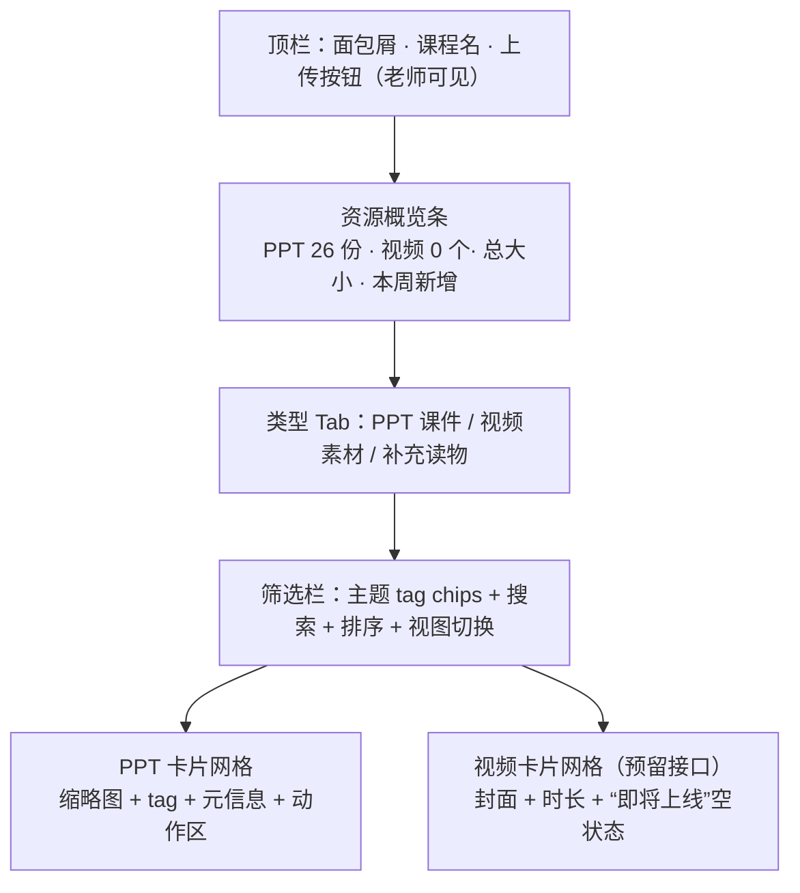
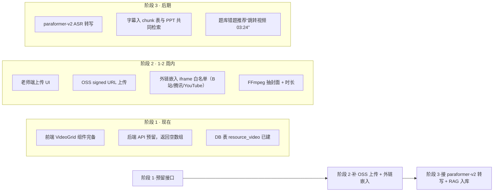

<aside>
📚

**本页定位：**作为「小飞」前端工程交付包 v1.1 · Pro/Flash 路由器 + RAG + Markdown 契约 + 拷贝组件的第二个扩展模块，规范「小飞」**课程资料页**（`/materials/[course_code]`）的视觉设计、信息架构、交互行为与可复制实现。本页**主管 PPT 课件**，同时预留「视频素材」接口，后期可无缝补充。

**适用范围：**课程资料首页（截图所示）。资料详情/预览/下载记录页另起规范。

**与题库页的关系：**两页同享 `.main` 三层容器与深色主题 token，仅业务区组件不同。

</aside>

## 〇、问题清单（重设计依据）

基于截图与题库页同源问题，定位 9 个必修点：

| # | 问题 | 后果 | P |
| --- | --- | --- | --- |
| 1 | 背景纯白 vs 左侧深色 | 与左侧栏视觉断裂，同题库页同根 | P0 |
| 2 | 无滚动条 | 26 个课件势必超出一屏，看不到后面 | P0 |
| 3 | 「全部」tag 纯黑底，与其他 tag 视觉不一致 | 与题库页「章节练习」同一个 bug | P1 |
| 4 | 搜索框与 tag 并行摆放但独立独行 | 空间浪费，交互语义不清 | P2 |
| 5 | 卡片只有文件名 + 在线浏览/下载 | 没有缩略图预览，识别成本高 | P1 |
| 6 | 没有排序与视图切换（网格/列表） | 多资料场景下查找效率低 | P2 |
| 7 | 没有视频区域，后续素材无处安放 | 只能重构页面才能加视频 | P1 |
| 8 | 没有资源类型图标、上传时间、浏览量 | 元信息贫乏，老师/学员都判断不了价值 | P2 |
| 9 | 没有面包屑绑定课程 | 跨课后不知道指哪门课，多课程部署时冲突 | P2 |

---

## 一、信息架构（含视频预留）



### 与题库页的交集与区别

| 维度 | 题库页 | 资料页（本页） |
| --- | --- | --- |
| 主容器 | `.main`  • `.main-scroll` | **同** |
| 学情条 | 总题/已做/正确率/今日新增 | **资源概览条**：PPT/视频/总大小/本周新增 |
| 主列表 | 章节选择列 | **卡片网格**（2-3 列响应式） |
| 筛选 | 难度/状态/来源/顺序 chips | **主题 tag** chips + 排序下拉 + 视图切换 |
| CTA | 贯通「开始练习」 | **无全局 CTA**，动作走在卡片内 |

---

## 二、设计 Token（直接复用父包 v1.1）

本页不新增任何 token。可复用【题库练习页 UI 规范 §二】的 surface/border/text/accent/success/danger 全套 token。新增两个**类型色**仅用于文件贴纸色：

| Token | 值 | 用途 |
| --- | --- | --- |
| `--type-ppt` | `#F59E0B` | PPT / PPTX 标记色（橙） |
| `--type-ppt-bg` | `rgba(245,158,11,0.14)` | PPT 贴纸背景 |
| `--type-video` | `#22D3EE` | 视频标记色（青） |
| `--type-video-bg` | `rgba(34,211,238,0.14)` | 视频贴纸背景 |
| `--type-pdf` | `#EF4444` | 后续补充读物使用 |

---

## 三、滚动架构（P0 · 与题库页同根修复）

资料页无滚动条与题库页是同一个 CSS bug。拷贝题库页规范 §三 的完整 CSS 即可，无任何变更。**关键两行**：

```css
.main      { display: flex; flex-direction: column; min-height: 0; }
.main-scroll { flex: 1; overflow-y: auto; min-height: 0; }
```

---

## 四、页面 TSX 骨架

```tsx
// apps/web/app/materials/[code]/page.tsx
import { ResourceOverview } from '@/components/materials/ResourceOverview'
import { TypeTabs } from '@/components/materials/TypeTabs'
import { ToolbarRow } from '@/components/materials/ToolbarRow'
import { PptGrid } from '@/components/materials/PptGrid'
import { VideoGrid } from '@/components/materials/VideoGrid'
import { useMaterialsStore } from '@/stores/materials'
import { Breadcrumbs } from '@/components/shared/Breadcrumbs'

export default function MaterialsPage({ params }: { params: { code: string } }) {
	const { activeType } = useMaterialsStore()
	return (
		<div className="main">
			<header className="main-header">
				<Breadcrumbs items={[
					{ label: '课程中心', href: '/courses' },
					{ label: '飞行原理', href: `/courses/${params.code}` },
					{ label: '课程资料' },
				]}/>
				<div className="page-title-row">
					<h1 className="page-title">课程资料</h1>
					<UploadButton courseCode={params.code} />   {/* 仅老师可见 */}
				</div>
				<p className="page-sub">已接入飞行原理 26 个课件 PDF，支持章节筛选、搜索、浏览和下载。</p>
			</header>

			<div className="main-scroll">
				<ResourceOverview courseCode={params.code} />     {/* Block 1 */}
				<TypeTabs />                                       {/* Block 2 */}
				<ToolbarRow />                                     {/* Block 3 */}

				{activeType === 'ppt'   && <PptGrid   courseCode={params.code} />}
				{activeType === 'video' && <VideoGrid courseCode={params.code} />}
				{activeType === 'reading' && <ReadingComingSoon />}
			</div>
		</div>
	)
}
```

---

## 五、Block 1 · 资源概览条（类似题库 KPI，但是以资产为中心）

### TSX

```tsx
// components/materials/ResourceOverview.tsx
import { FileText, Video, HardDrive, Sparkles } from 'lucide-react'
import { useQuery } from '@tanstack/react-query'

export function ResourceOverview({ courseCode }: { courseCode: string }) {
	const { data } = useQuery({
		queryKey: ['materials', 'overview', courseCode],
		queryFn: () => fetch(`/api/materials/${courseCode}/overview`).then(r => r.json()),
	})

	const items = [
		{ icon: FileText,  label: 'PPT 课件',  value: data?.pptCount   ?? '—', tint: 'ppt'   },
		{ icon: Video,     label: '视频素材', value: data?.videoCount ?? '—', tint: 'video', muted: !data?.videoCount },
		{ icon: HardDrive, label: '总大小',    value: data?.totalSize  ?? '—'                  },
		{ icon: Sparkles,  label: '本周新增', value: data?.weekNew    ?? '—'                  },
	]

	return (
		<div className="overview-strip">
			{items.map(it => (
				<div key={it.label} className={`ov-card ${it.muted ? 'ov-muted' : ''}`}>
					<div className={`ov-icon ${it.tint ? `tint-${it.tint}` : ''}`}><it.icon size={18}/></div>
					<div className="ov-text">
						<div className="ov-label">{it.label}</div>
						<div className="ov-value">{it.value}</div>
					</div>
				</div>
			))}
		</div>
	)
}
```

### CSS

```css
.overview-strip {
	position: sticky; top: 0; z-index: 5;
	display: grid; grid-template-columns: repeat(4, 1fr); gap: 16px;
	padding: 12px 0 16px;
	background: var(--surface-0);
}

.ov-card {
	display: flex; align-items: center; gap: 12px;
	background: var(--surface-1); border: 1px solid var(--border);
	border-radius: 12px; padding: 14px 16px; height: 72px;
}
.ov-muted { opacity: .6; }   /* 视频 count=0 时减色 */

.ov-icon {
	width: 36px; height: 36px; border-radius: 10px;
	display: inline-flex; align-items: center; justify-content: center;
	background: var(--surface-2); color: var(--text-muted);
}
.ov-icon.tint-ppt   { background: var(--type-ppt-bg);   color: var(--type-ppt); }
.ov-icon.tint-video { background: var(--type-video-bg); color: var(--type-video); }

.ov-label { font-size: 12px; color: var(--text-muted); }
.ov-value { font-size: 20px; font-weight: 600; color: var(--text-primary); }
```

---

## 六、Block 2 · 类型 Tab（PPT / 视频 / 补充读物）

### TSX

```tsx
// components/materials/TypeTabs.tsx
import { useMaterialsStore } from '@/stores/materials'
import { FileText, Video, BookOpen } from 'lucide-react'

const TABS = [
	{ id: 'ppt',     icon: FileText, label: 'PPT 课件',  badge: (c: any) => c?.pptCount   ?? 0 },
	{ id: 'video',   icon: Video,    label: '视频素材', badge: (c: any) => c?.videoCount ?? 0, soon: true },
	{ id: 'reading', icon: BookOpen, label: '补充读物', badge: (c: any) => c?.readingCount ?? 0, soon: true },
] as const

export function TypeTabs() {
	const { activeType, setType, counts } = useMaterialsStore()
	return (
		<nav className="type-tabs" role="tablist">
			{TABS.map(t => {
				const active = activeType === t.id
				const count = t.badge(counts)
				return (
					<button
						key={t.id}
						role="tab"
						aria-selected={active}
						className={`type-tab ${active ? 'is-active' : ''}`}
						onClick={() => setType(t.id)}
					>
						<t.icon size={16}/>
						<span>{t.label}</span>
						<span className="type-tab-badge">{count}</span>
						{t.soon && count === 0 && <span className="type-tab-soon">预留</span>}
					</button>
				)
			})}
		</nav>
	)
}
```

### CSS

```css
.type-tabs {
	display: flex; gap: 4px;
	padding: 4px;
	background: var(--surface-1);
	border: 1px solid var(--border);
	border-radius: 12px;
	width: fit-content;
	margin-bottom: 16px;
}
.type-tab {
	display: inline-flex; align-items: center; gap: 8px;
	padding: 8px 14px; border-radius: 8px;
	background: transparent; border: 0; cursor: pointer;
	color: var(--text-muted); font-size: 14px;
	transition: background .15s, color .15s;
}
.type-tab:hover { background: var(--surface-2); color: var(--text-primary); }
.type-tab.is-active {
	background: var(--accent-bg); color: var(--accent);
}
.type-tab-badge {
	font-size: 11px; padding: 2px 7px; border-radius: 999px;
	background: var(--surface-2); color: var(--text-muted);
}
.type-tab.is-active .type-tab-badge { background: var(--accent); color: #fff; }
.type-tab-soon {
	font-size: 10px; padding: 1px 6px; border-radius: 4px;
	background: var(--surface-2); color: var(--text-muted);
	letter-spacing: .04em;
}
```

---

## 七、Block 3 · 工具栏（Tag chips + 搜索 + 排序 + 视图切换）

### TSX

```tsx
// components/materials/ToolbarRow.tsx
import { useMaterialsStore } from '@/stores/materials'
import { Search, LayoutGrid, List, ChevronDown } from 'lucide-react'
import { useQuery } from '@tanstack/react-query'

export function ToolbarRow() {
	const { tag, setTag, query, setQuery, view, setView, sort, setSort } = useMaterialsStore()
	const { data: tags = [] } = useQuery<string[]>({
		queryKey: ['materials', 'tags'],
		queryFn: () => fetch('/api/materials/tags').then(r => r.json()),
	})

	return (
		<div className="toolbar-row">
			<div className="toolbar-search">
				<Search size={16}/>
				<input
					value={query}
					onChange={e => setQuery(e.target.value)}
					placeholder="搜索课件标题、文件名或关键词..."
				/>
			</div>

			<div className="toolbar-chips">
				<button
					className={`mt-chip ${!tag ? 'is-active' : ''}`}
					onClick={() => setTag(null)}
				>全部</button>
				{tags.map(t => (
					<button
						key={t}
						className={`mt-chip ${tag === t ? 'is-active' : ''}`}
						onClick={() => setTag(t)}
					>{t}</button>
				))}
			</div>

			<div className="toolbar-right">
				<select className="sort-select" value={sort} onChange={e => setSort(e.target.value as any)}>
					<option value="chapter">按章节</option>
					<option value="newest">最近上传</option>
					<option value="size">文件大小</option>
					<option value="popular">浏览量</option>
				</select>
				<div className="view-toggle">
					<button aria-pressed={view==='grid'} onClick={() => setView('grid')}><LayoutGrid size={16}/></button>
					<button aria-pressed={view==='list'} onClick={() => setView('list')}><List size={16}/></button>
				</div>
			</div>
		</div>
	)
}
```

### CSS

```css
.toolbar-row {
	display: grid;
	grid-template-columns: 320px 1fr auto;
	align-items: center;
	gap: 16px;
	margin-bottom: 20px;
}

.toolbar-search {
	display: flex; align-items: center; gap: 8px;
	height: 40px; padding: 0 14px;
	background: var(--surface-1); border: 1px solid var(--border); border-radius: 10px;
	color: var(--text-muted);
}
.toolbar-search input {
	flex: 1; background: transparent; border: 0; outline: 0;
	font-size: 14px; color: var(--text-primary);
}

.toolbar-chips { display: flex; flex-wrap: wrap; gap: 8px; }
.mt-chip {
	padding: 6px 14px; border-radius: 999px;
	background: var(--surface-1); border: 1px solid var(--border);
	color: var(--text-primary); font-size: 13px; cursor: pointer;
	transition: background .15s, color .15s, border-color .15s;
}
.mt-chip:hover { background: var(--surface-2); }
.mt-chip.is-active {
	background: var(--accent-bg); border-color: var(--accent); color: var(--accent);
}

.toolbar-right { display: flex; align-items: center; gap: 10px; }
.sort-select {
	height: 36px; padding: 0 10px;
	background: var(--surface-1); border: 1px solid var(--border);
	color: var(--text-primary); border-radius: 8px;
	font-size: 13px;
}
.view-toggle {
	display: inline-flex; padding: 2px;
	background: var(--surface-1); border: 1px solid var(--border); border-radius: 8px;
}
.view-toggle button {
	width: 32px; height: 32px; border: 0; background: transparent;
	color: var(--text-muted); cursor: pointer; border-radius: 6px;
	display: inline-flex; align-items: center; justify-content: center;
}
.view-toggle button[aria-pressed='true'] { background: var(--accent-bg); color: var(--accent); }
```

<aside>
💡

**注：**主题 tag（「飞机与大气」「空气动力学基础」等）与题库页的难度/状态 chip 语义不同。本页 tag 是**课程内容分类**，从后端 `/api/materials/tags` 动态拉，不是写死枚举。未来换课程时不需修改前端。

</aside>

---

## 八、Block 4 · PPT 卡片（含缩略图 + 动作区）

### TSX

```tsx
// components/materials/PptGrid.tsx
import { useQuery } from '@tanstack/react-query'
import { Eye, Download, Star, MoreHorizontal } from 'lucide-react'
import { useMaterialsStore } from '@/stores/materials'
import { formatBytes, formatDate } from '@/lib/format'

type Ppt = {
	id: string
	title: string
	description?: string
	fileName: string
	fileSize: number
	tag: string
	thumbnailUrl?: string   // 首帧/封面缩略图
	pages: number
	uploadedAt: string
	viewCount: number
	downloadCount: number
	favorited?: boolean
}

export function PptGrid({ courseCode }: { courseCode: string }) {
	const { tag, query, sort, view } = useMaterialsStore()
	const { data: list = [], isLoading } = useQuery<Ppt[]>({
		queryKey: ['materials', 'ppt', courseCode, { tag, query, sort }],
		queryFn: () => fetch(
			`/api/materials/${courseCode}/ppt?tag=${tag ?? ''}&q=${encodeURIComponent(query)}&sort=${sort}`
		).then(r => r.json()),
	})

	if (isLoading) return <PptGridSkeleton view={view}/>
	if (list.length === 0) return <EmptyState query={query} tag={tag}/>

	return (
		<div className={view === 'grid' ? 'ppt-grid' : 'ppt-list'}>
			{list.map(p => view === 'grid' ? <PptCard key={p.id} ppt={p}/> : <PptRow key={p.id} ppt={p}/>)}
		</div>
	)
}

function PptCard({ ppt }: { ppt: Ppt }) {
	return (
		<article className="ppt-card">
			<a href={`/materials/preview/${ppt.id}`} className="ppt-thumb">
				{ppt.thumbnailUrl
					? 
					: <div className="ppt-thumb-fallback">PPT</div>}
				<span className="ppt-pages">{ppt.pages} 页</span>
			</a>

			<div className="ppt-body">
				<div className="ppt-tagrow">
					<span className="ppt-tag">{ppt.tag}</span>
					<span className="ppt-size">{formatBytes(ppt.fileSize)}</span>
				</div>
				<h3 className="ppt-title" title={ppt.title}>{ppt.title}</h3>
				{ppt.description && <p className="ppt-desc">{ppt.description}</p>}
				<div className="ppt-meta">
					<span title={ppt.fileName}>{ppt.fileName}</span>
					<span className="ppt-meta-dot">·</span>
					<span>{formatDate(ppt.uploadedAt)}</span>
					<span className="ppt-meta-dot">·</span>
					<span>浏览 {ppt.viewCount}</span>
				</div>

				<div className="ppt-actions">
					<a className="btn-ghost"  href={`/materials/preview/${ppt.id}`}><Eye size={14}/>在线浏览</a>
					<a className="btn-primary" href={`/api/materials/download/${ppt.id}`}><Download size={14}/>下载</a>
					<button className="btn-icon" aria-pressed={ppt.favorited}><Star size={16}/></button>
					<button className="btn-icon"><MoreHorizontal size={16}/></button>
				</div>
			</div>
		</article>
	)
}
```

### CSS

```css
/* 网格视图 */
.ppt-grid {
	display: grid;
	grid-template-columns: repeat(auto-fill, minmax(360px, 1fr));
	gap: 16px;
}

.ppt-card {
	display: flex; flex-direction: column;
	background: var(--surface-1);
	border: 1px solid var(--border);
	border-radius: 14px;
	overflow: hidden;
	transition: transform .15s, border-color .15s, box-shadow .15s;
}
.ppt-card:hover {
	transform: translateY(-2px);
	border-color: rgba(155,134,255,0.4);
	box-shadow: 0 8px 24px rgba(0,0,0,0.24);
}

/* 缩略图 */
.ppt-thumb {
	position: relative;
	aspect-ratio: 16 / 9;
	background: var(--surface-2);
	display: block;
	overflow: hidden;
}
.ppt-thumb img { width: 100%; height: 100%; object-fit: cover; }
.ppt-thumb-fallback {
	width: 100%; height: 100%;
	display: flex; align-items: center; justify-content: center;
	font-size: 28px; font-weight: 700; color: var(--type-ppt);
	background: linear-gradient(135deg, var(--type-ppt-bg), transparent 70%);
	letter-spacing: .08em;
}
.ppt-pages {
	position: absolute; right: 8px; bottom: 8px;
	font-size: 11px; padding: 2px 8px; border-radius: 999px;
	background: rgba(0,0,0,.55); color: #fff;
	backdrop-filter: blur(4px);
}

/* 卡体 */
.ppt-body { padding: 14px 16px 16px; display: flex; flex-direction: column; gap: 6px; }
.ppt-tagrow { display: flex; align-items: center; justify-content: space-between; }
.ppt-tag {
	font-size: 12px; padding: 3px 10px; border-radius: 6px;
	background: var(--type-ppt-bg); color: var(--type-ppt);
}
.ppt-size { font-size: 12px; color: var(--text-muted); }
.ppt-title {
	font-size: 15px; font-weight: 600; color: var(--text-primary);
	margin: 4px 0 2px;
	display: -webkit-box; -webkit-line-clamp: 2; -webkit-box-orient: vertical;
	overflow: hidden;
}
.ppt-desc {
	font-size: 13px; color: var(--text-muted); line-height: 1.5;
	display: -webkit-box; -webkit-line-clamp: 2; -webkit-box-orient: vertical;
	overflow: hidden;
}
.ppt-meta {
	font-size: 11px; color: var(--text-muted);
	display: flex; flex-wrap: wrap; align-items: center; gap: 4px;
}
.ppt-meta-dot { opacity: .5; }

/* 动作区 */
.ppt-actions {
	display: flex; align-items: center; gap: 8px;
	margin-top: 12px; padding-top: 12px;
	border-top: 1px solid var(--border);
}
.btn-ghost, .btn-primary {
	display: inline-flex; align-items: center; gap: 6px;
	height: 32px; padding: 0 12px;
	border-radius: 8px; font-size: 13px;
	text-decoration: none; cursor: pointer; border: 0;
}
.btn-ghost   { background: var(--surface-2); color: var(--text-primary); }
.btn-ghost:hover  { background: var(--surface-2); filter: brightness(1.15); }
.btn-primary { background: var(--accent); color: #fff; margin-left: auto; }
.btn-primary:hover { filter: brightness(1.08); }
.btn-icon {
	width: 32px; height: 32px;
	background: transparent; border: 1px solid var(--border); border-radius: 8px;
	color: var(--text-muted); display: inline-flex; align-items: center; justify-content: center;
	cursor: pointer;
}
.btn-icon:hover, .btn-icon[aria-pressed='true'] {
	background: var(--accent-bg); color: var(--accent); border-color: var(--accent);
}

/* 列表视图（紧凑横条） */
.ppt-list {
	display: flex; flex-direction: column;
	background: var(--surface-1);
	border: 1px solid var(--border);
	border-radius: 12px;
	overflow: hidden;
}
.ppt-row {
	display: grid;
	grid-template-columns: 56px 1fr 100px 100px 120px 180px;
	align-items: center; gap: 16px;
	padding: 12px 16px;
	border-bottom: 1px solid var(--border);
	transition: background .15s;
}
.ppt-row:last-child { border-bottom: 0; }
.ppt-row:hover { background: var(--surface-2); }
```

---

## 九、Block 5 · 视频卡片（预留接口，后期可填）

### 设计原则

1. **现阶段**：视频 Tab 默认 count=0，点进去看到"即将上线"空状态 + 老师端「上传视频」按钮。
2. **后期**：后端调通后同一份前端代码自动起作用，无需重构页面。
3. **类型色**与 PPT 区分（青色 vs 橙色），一眼可辨。

### TSX

```tsx
// components/materials/VideoGrid.tsx
import { useQuery } from '@tanstack/react-query'
import { Play, Clock, Upload, Sparkles } from 'lucide-react'
import { formatDuration } from '@/lib/format'

type Video = {
	id: string
	title: string
	description?: string
	tag: string
	posterUrl?: string
	durationSec: number
	source: 'oss' | 'bilibili' | 'youtube' | 'tencent' | 'iframe'
	playUrl: string
	uploadedAt: string
	viewCount: number
}

export function VideoGrid({ courseCode }: { courseCode: string }) {
	const { data: list = [], isLoading } = useQuery<Video[]>({
		queryKey: ['materials', 'video', courseCode],
		queryFn: () => fetch(`/api/materials/${courseCode}/video`).then(r => r.json()),
	})

	if (isLoading) return <VideoGridSkeleton/>
	if (list.length === 0) return <VideoComingSoon courseCode={courseCode}/>

	return (
		<div className="ppt-grid">
			{list.map(v => <VideoCard key={v.id} video={v}/>)}
		</div>
	)
}

function VideoCard({ video }: { video: Video }) {
	return (
		<article className="ppt-card">
			<a href={`/materials/video/${video.id}`} className="ppt-thumb video-thumb">
				{video.posterUrl
					? 
					: <div className="video-thumb-fallback"><Play size={32}/></div>}
				<span className="video-play"><Play size={20} fill="#fff"/></span>
				<span className="video-duration"><Clock size={11}/>{formatDuration(video.durationSec)}</span>
			</a>
			<div className="ppt-body">
				<div className="ppt-tagrow">
					<span className="video-tag">{video.tag}</span>
					<span className="ppt-size">{video.source.toUpperCase()}</span>
				</div>
				<h3 className="ppt-title">{video.title}</h3>
				{video.description && <p className="ppt-desc">{video.description}</p>}
			</div>
		</article>
	)
}

function VideoComingSoon({ courseCode }: { courseCode: string }) {
	return (
		<div className="empty-card">
			<div className="empty-icon"><Sparkles size={28}/></div>
			<h3>视频素材即将上线</h3>
			<p>后台接口已预留，支持上传 OSS 视频、嵌入 B 站 / 腾讯视频 / YouTube 外链。</p>
			<a className="btn-primary" href={`/teacher/${courseCode}/materials/video/new`}>
				<Upload size={14}/>上传首个视频
			</a>
		</div>
	)
}
```

### CSS

```css
.video-thumb { background: #000; }
.video-thumb-fallback {
	width: 100%; height: 100%;
	display: flex; align-items: center; justify-content: center;
	color: var(--type-video);
	background: linear-gradient(135deg, var(--type-video-bg), transparent 70%);
}
.video-play {
	position: absolute; inset: 0; margin: auto;
	width: 56px; height: 56px; border-radius: 50%;
	background: rgba(0,0,0,0.55);
	display: flex; align-items: center; justify-content: center;
	backdrop-filter: blur(8px);
	color: #fff;
	transition: transform .15s, background .15s;
}
.ppt-card:hover .video-play { transform: scale(1.08); background: rgba(0,0,0,0.7); }
.video-duration {
	position: absolute; right: 8px; bottom: 8px;
	display: inline-flex; align-items: center; gap: 4px;
	font-size: 11px; padding: 2px 8px; border-radius: 999px;
	background: rgba(0,0,0,.55); color: #fff;
}
.video-tag {
	font-size: 12px; padding: 3px 10px; border-radius: 6px;
	background: var(--type-video-bg); color: var(--type-video);
}

/* 空状态 */
.empty-card {
	display: flex; flex-direction: column; align-items: center; gap: 12px;
	padding: 56px 24px;
	background: var(--surface-1); border: 1px dashed var(--border);
	border-radius: 14px;
	text-align: center;
}
.empty-icon {
	width: 56px; height: 56px; border-radius: 16px;
	background: var(--type-video-bg); color: var(--type-video);
	display: flex; align-items: center; justify-content: center;
}
.empty-card h3 { font-size: 16px; font-weight: 600; color: var(--text-primary); }
.empty-card p { font-size: 13px; color: var(--text-muted); max-width: 480px; }
```

---

## 十、Zustand Store

```tsx
// stores/materials.ts
import { create } from 'zustand'

type TypeId = 'ppt' | 'video' | 'reading'
type ViewMode = 'grid' | 'list'
type SortKey = 'chapter' | 'newest' | 'size' | 'popular'

type MaterialsState = {
	activeType: TypeId
	tag: string | null
	query: string
	sort: SortKey
	view: ViewMode
	counts: { pptCount: number; videoCount: number; readingCount: number } | null
	setType: (t: TypeId) => void
	setTag: (t: string | null) => void
	setQuery: (q: string) => void
	setSort: (s: SortKey) => void
	setView: (v: ViewMode) => void
	setCounts: (c: MaterialsState['counts']) => void
}

export const useMaterialsStore = create<MaterialsState>((set) => ({
	activeType: 'ppt',
	tag: null,
	query: '',
	sort: 'chapter',
	view: 'grid',
	counts: null,
	setType:   (activeType) => set({ activeType }),
	setTag:    (tag) => set({ tag }),
	setQuery:  (query) => set({ query }),
	setSort:   (sort) => set({ sort }),
	setView:   (view) => set({ view }),
	setCounts: (counts) => set({ counts }),
}))
```

---

## 十一、后端 API 契约

### 资源总览

```tsx
GET /api/materials/:code/overview
→ {
	pptCount: number,
	videoCount: number,
	readingCount: number,
	totalSize: string,    // "1.2 GB" 预格化
	weekNew: number,
}
```

### Tag 字典

```tsx
GET /api/materials/tags?course=:code
→ string[]  // ["飞机与大气", "空气动力学基础", ...]
```

### PPT 列表

```tsx
GET /api/materials/:code/ppt?tag=&q=&sort=&page=&size=
→ Ppt[] {
	id, title, description, fileName, fileSize, tag,
	thumbnailUrl, pages, uploadedAt, viewCount, downloadCount, favorited
}
```

### 视频列表（预留）

```tsx
GET /api/materials/:code/video?tag=&q=&sort=&page=&size=
→ Video[] {
	id, title, description, tag,
	posterUrl,
	durationSec,
	source: 'oss' | 'bilibili' | 'youtube' | 'tencent' | 'iframe',
	playUrl,            // 原始播放 URL / iframe URL / signed OSS URL
	uploadedAt, viewCount
}
```

### 上传与下载

```tsx
POST /api/materials/:code/upload          // 仅老师，返回 signed URL
GET  /api/materials/download/:id          // 走鉴权 + 计数
GET  /api/materials/preview/:id           // 在线预览（PPT 转 PDF后 iframe）
POST /api/materials/favorite/:id          // 收藏切换
```

---

## 十二、数据库 Schema（增量，与父包 §一.5 兼容）

```sql
-- PPT 课件表
CREATE TABLE resource_ppt (
	id           uuid PRIMARY KEY DEFAULT gen_random_uuid(),
	course_code  text NOT NULL REFERENCES course(code),
	title        text NOT NULL,
	description  text,
	file_name    text NOT NULL,
	file_size    bigint NOT NULL,
	oss_key      text NOT NULL,           -- OSS 对象 key
	mime         text NOT NULL DEFAULT 'application/pdf',
	tag          text NOT NULL,           -- 「飞机与大气」等
	chapter_code text,                    -- 可选：绑章节以便题库联动
	pages        int NOT NULL DEFAULT 0,
	thumbnail_oss_key text,               -- 首帧/封面
	uploaded_by  uuid REFERENCES auth.users(id),
	uploaded_at  timestamptz NOT NULL DEFAULT now(),
	view_count   int NOT NULL DEFAULT 0,
	download_count int NOT NULL DEFAULT 0,
	status       text NOT NULL DEFAULT 'ready'  -- uploaded/parsing/ready/failed
);
CREATE INDEX ON resource_ppt(course_code, tag);
CREATE INDEX ON resource_ppt(uploaded_at DESC);

-- 视频表（预留）
CREATE TABLE resource_video (
	id           uuid PRIMARY KEY DEFAULT gen_random_uuid(),
	course_code  text NOT NULL REFERENCES course(code),
	title        text NOT NULL,
	description  text,
	tag          text NOT NULL,
	chapter_code text,
	source       text NOT NULL CHECK (source IN ('oss','bilibili','youtube','tencent','iframe')),
	play_url     text NOT NULL,
	oss_key      text,                    -- source='oss' 时必填
	poster_oss_key text,
	duration_sec int NOT NULL DEFAULT 0,
	transcript_md text,                   -- 后期 paraformer 转写作为 RAG 输入
	uploaded_by  uuid REFERENCES auth.users(id),
	uploaded_at  timestamptz NOT NULL DEFAULT now(),
	view_count   int NOT NULL DEFAULT 0,
	status       text NOT NULL DEFAULT 'ready'
);
CREATE INDEX ON resource_video(course_code, tag);

-- 收藏表（多资源类型共享）
CREATE TABLE resource_favorite (
	user_id      uuid NOT NULL REFERENCES auth.users(id),
	resource_id  uuid NOT NULL,
	resource_type text NOT NULL CHECK (resource_type IN ('ppt','video','reading')),
	created_at   timestamptz NOT NULL DEFAULT now(),
	PRIMARY KEY (user_id, resource_id, resource_type)
);

-- 访问日志（用于热门排序 + 教师看班级使用情况）
CREATE TABLE resource_access_log (
	id           bigserial PRIMARY KEY,
	user_id      uuid NOT NULL,
	resource_id  uuid NOT NULL,
	resource_type text NOT NULL,
	action       text NOT NULL CHECK (action IN ('view','download','play')),
	created_at   timestamptz NOT NULL DEFAULT now()
);
CREATE INDEX ON resource_access_log(resource_id, action, created_at);
```

---

## 十三、视频接入三阶段路径图



<aside>
🎯

**关键决策：**本阶段只需**前端预留 + DB 建表 + API 返回空数组**三件事。后期补视频时 0 前端改动。

</aside>

---

## 十四、预览弹窗与在线浏览策略

| 场景 | 策略 | 实现要点 |
| --- | --- | --- |
| PPT 在线浏览 | **PPT 转 PDF 后 iframe**，避免浏览器兼容 | 上传后后台用 LibreOffice headless 转 PDF；OSS 使用 30 分钟 signed URL |
| 防下载需求 | PDF.js 自定义渲染，禁右键 + 水印 | 可选项；教学场景默认允许下载 |
| OSS 视频 | signed URL + Plyr.js 播放器 | 支持倍速、字幕轨道；HLS 切片可选 |
| B站/腾讯/YouTube | iframe 嵌入 | 白名单校验域名；添 `referrerpolicy="strict-origin"` |
| 移动端 | 预览全屏化 | < 768px 时预览跳转独立页 `/preview/:id` |

---

## 十五、可访问性与响应式

| 维度 | 规范 |
| --- | --- |
| 键盘快捷键 | `/` 聚焦搜索；`g`  • `p`/`v`/`r` 切换类型 Tab |
| 列表虚拟滚动 | 资源 > 100 个时启用 react-virtuoso，避免 DOM 起炽脱湿 |
| 响应式：≥ 1440px | ppt-grid 3 列；overview 4 列 |
| 1024–1439 | ppt-grid 2 列；overview 4 列 |
| 768–1023 | ppt-grid 2 列；toolbar-row 叠加为两行；overview 2 列 |
| &lt; 768 | ppt-grid 1 列；view-toggle 隐藏；overview 横向滚动 |
| 图片加载 | thumbnail 加 `loading="lazy"`  • `decoding="async"` |
| 热门资源 | top-10 PPT 预加载 thumbnail（`<link rel="preload">`） |

---

## 十六、验收清单

- [ ]  **P0** 整页能正常滚动（`.main` + `.main-scroll` 均设 `min-height: 0`）
- [ ]  **P0** 主区切换深色主题，与左侧栏视觉统一
- [ ]  **P0** 滚动条与题库页一致
- [ ]  **P1** 「全部」chip 使用 accent 紫选中态，不再是纯黑底
- [ ]  **P1** 卡片增加缩略图（PPT 首帧或 fallback）
- [ ]  **P1** 视频 Tab 可点击，进入后看到“即将上线”空状态 + 老师上传入口
- [ ]  **P1** 后端 `resource_video` 表建立，`/api/materials/:code/video` 返回 `[]`
- [ ]  **P2** 工具栏含排序下拉（章节/最新/大小/热门）与视图切换（网格/列表）
- [ ]  **P2** 资源概览条 4 张卡，sticky 顶部
- [ ]  **P2** 面包屑显示当前课程
- [ ]  **P2** 卡片动作区含 浏览 / 下载 / 收藏 / 更多
- [ ]  **P3** 列表视图（紧凑横条）调通
- [ ]  **P3** 热门排序接入 `resource_access_log` 聚合
- [ ]  **P3** 100+ 资源场景下启用 react-virtuoso
- [ ]  **A11y** Tab 顺序、ARIA 、`/` 快捷键完备
- [ ]  **响应式** 四档断点下布局不破

---

## 十七、与 v1.1 父包 · 题库页的关系

<aside>
🔗

**复用：**`.main` `.main-scroll` 三层容器、`min-height:0` 修复、surface tokens、紫色 accent、滚动条样式——**与题库页 100% 共享**。

**新增：**`.overview-strip` `.ov-card` `.type-tabs` `.toolbar-row` `.mt-chip` `.ppt-card` `.ppt-thumb` `.ppt-actions` `.video-thumb` `.empty-card` 与两个类型色 token（`--type-ppt` `--type-video`）是本页专有。

**与题库页的互补：**`resource_ppt.chapter_code` 与 `question.chapter_code` 同键，使题库页「错题详情」能跳回资料页「在线浏览 PPT 12-15 页」，形成闭环。

</aside>
