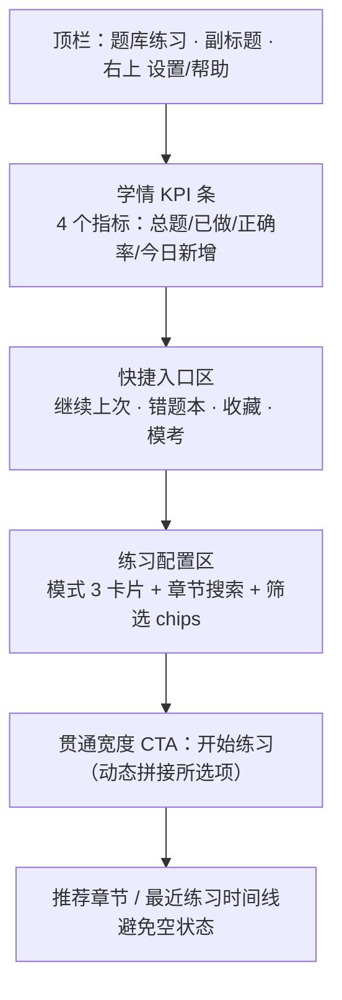

<aside>
📘

**本页定位：**作为「小飞」前端工程交付包 v1.1 · Pro/Flash 路由器 + RAG + Markdown 契约 + 拷贝组件的扩展模块，规范「小飞」**题库练习页**（`/qbank/[course_code]`）的视觉设计、信息架构、交互行为与可复制实现。所有 TSX / CSS / Token 均与父交付包的三层容器、深色主题、紫色 accent 保持一致。

**适用范围：**章节练习、随机组卷、闯关模式三种入口的承载页（截图所示页面）。答题中页与结算页另起规范。

</aside>

## 〇、问题清单（重设计的依据）

基于截图与代码现状，定位到 8 个必须修复的问题：

| # | 问题 | 后果 | 修复优先级 |
| --- | --- | --- | --- |
| 1 | 三个模式做成纯文字 pill，「章节练习」用纯黑底 | 不像可选卡片，与左侧紫色徽标不呼应 | P1 |
| 2 | 章节下拉是原生 select | 深色 UI 里特别廉价，470 题等关键数据被淹没 | P1 |
| 3 | 「开始练习」按钮孤悬右上 | 视线在"选章节 → 跳到右上"来回跑 | P1 |
| 4 | 中部大块空白 + 一句话占位 | 不像学习产品，更像 404 | P2 |
| 5 | 没有「继续上次 / 错题本 / 收藏夹 / 未做过」入口 | 题库类产品的核心复访动线全部缺失 | P2 |
| 6 | 没有学情条（总题数 / 已做 / 正确率 / 掌握度） | 左下角的 KPI 在主区零体现 | P2 |
| 7 | 背景纯白 vs 左侧深色 | 缺少 surface 层级，整页视觉断裂 | P0 |
| 8 | 无滚动条 | 与对话页同源 bug，父容器没设 min-height:0 | P0 |

---

## 一、整页信息架构



**滚动单元：**整页只有一个滚动容器 `.main-scroll`，KPI 条在其中 `sticky top:0`。Composer 不存在于本页（无对话气泡）。

---

## 二、设计 Token（与父包 v1.1 完全对齐）

| Token | 浅色（备选） | 深色（主推） | 用途 |
| --- | --- | --- | --- |
| `--surface-0` | `#FAFAFA` | `#0B0B10` | 页面底色 |
| `--surface-1` | `#FFFFFF` | `#15151C` | 卡片底 |
| `--surface-2` | `#F4F4F6` | `#1E1E28` | 卡片 hover |
| `--border` | `#E6E6EA` | `rgba(255,255,255,0.08)` | 分隔线 / 卡片描边 |
| `--text-primary` | `#0F1115` | `#E8E8EE` | 主文 |
| `--text-muted` | `#6B6F76` | `#8A8E97` | 辅助文 |
| `--accent` | `#7C5CFF` | `#9B86FF` | 紫色主色 |
| `--accent-bg` | `rgba(124,92,255,0.10)` | `rgba(155,134,255,0.16)` | 选中态背景 |
| `--success` | `#16A34A` | `#34D399` | 正向变化 |
| `--danger` | `#DC2626` | `#F87171` | 负向变化 |

<aside>
⚠️

**强烈建议右侧主区切换到深色模式。**当前左深右白的撞色是页面最大的违和感来源，单点 surface token 切换即可，无需重写组件。

</aside>

---

## 三、滚动架构（P0 - 阻断性）

题库页无滚动条与对话页同根。**两行 `min-height: 0` 决定能否滚动**：

```css
/* ============ 全局根 ============ */
html, body, #root {
	height: 100%;
	overflow: hidden;
}

/* ============ App Shell ============ */
.app-shell {
	display: flex;
	height: 100vh;
	background: var(--surface-0);
	color: var(--text-primary);
}

.sidebar {
	width: 240px;
	flex-shrink: 0;
	overflow-y: auto;
	border-right: 1px solid var(--border);
}

/* ============ 右侧主区（关键） ============ */
.main {
	flex: 1;
	display: flex;
	flex-direction: column;
	min-width: 0;       /* 防内容把宽度撑爆 */
	min-height: 0;      /* ★ 没这一行子元素 overflow 全部失效 */
}

.main-header {
	flex-shrink: 0;
	padding: 24px 32px 12px;
	border-bottom: 1px solid var(--border);
}

.main-scroll {
	flex: 1;
	overflow-y: auto;
	min-height: 0;      /* ★ 同上，必须 */
	padding: 24px 32px 80px;
	scrollbar-gutter: stable;
}

/* ============ 自定义滚动条（深色） ============ */
.main-scroll::-webkit-scrollbar { width: 10px; }
.main-scroll::-webkit-scrollbar-thumb {
	background: rgba(255,255,255,0.12);
	border-radius: 5px;
	border: 2px solid transparent;
	background-clip: padding-box;
}
.main-scroll::-webkit-scrollbar-thumb:hover { background: rgba(255,255,255,0.22); }
.main-scroll { scrollbar-width: thin; scrollbar-color: rgba(255,255,255,0.18) transparent; }
```

---

## 四、页面 TSX 骨架（可直接复制）

```tsx
// apps/web/app/qbank/[code]/page.tsx
import { StatStrip } from '@/components/qbank/StatStrip'
import { QuickEntries } from '@/components/qbank/QuickEntries'
import { ModeCards } from '@/components/qbank/ModeCards'
import { ChapterPicker } from '@/components/qbank/ChapterPicker'
import { FilterChips } from '@/components/qbank/FilterChips'
import { StartCTA } from '@/components/qbank/StartCTA'
import { RecommendedChapters } from '@/components/qbank/RecommendedChapters'

export default function PracticePage({ params }: { params: { code: string } }) {
	return (
		<div className="main">
			<header className="main-header">
				<h1 className="page-title">题库练习</h1>
				<p className="page-sub">已接入飞行原理本地题库，可按章节练习、随机组卷和闯关训练。</p>
			</header>

			<div className="main-scroll">
				<StatStrip courseCode={params.code} />            {/* Block 1 */}
				<QuickEntries courseCode={params.code} />         {/* Block 2 */}

				<section className="card-section">
					<h2 className="section-title">选择练习方式</h2>
					<ModeCards />                                   {/* Block 3 */}
				</section>

				<section className="card-section">
					<h2 className="section-title">选择章节</h2>
					<ChapterPicker courseCode={params.code} />      {/* Block 4 */}
					<FilterChips />                                 {/* Block 5 */}
				</section>

				<StartCTA />                                      {/* Block 6 */}
				<RecommendedChapters courseCode={params.code} />  {/* 兜底 */}
			</div>
		</div>
	)
}
```

---

## 五、Block 1 · 学情 KPI 条

### 视觉规范

- 4 张等宽卡，横向排列，间距 16px，卡片 `min-width: 220px`，高度 88px
- 数字字号 28px / weight 600；趋势用 `↑` 绿 / `↓` 红 + 百分点
- 整条 sticky 在 `.main-scroll` 顶部；下滚 80px 后压缩到 56px（仅显示数字 + 标签）

### TSX

```tsx
// components/qbank/StatStrip.tsx
import { useQuery } from '@tanstack/react-query'
import { TrendingUp, TrendingDown } from 'lucide-react'

type Stat = {
	key: 'total' | 'attempted' | 'accuracy' | 'todayNew'
	label: string
	value: string
	delta?: { value: number; positive: boolean; suffix?: string }
}

export function StatStrip({ courseCode }: { courseCode: string }) {
	const { data } = useQuery<Stat[]>({
		queryKey: ['qbank', 'stats', courseCode],
		queryFn: () => fetch(`/api/qbank/${courseCode}/stats`).then(r => r.json()),
	})

	return (
		<div className="stat-strip">
			{(data ?? skeletonStats()).map(s => (
				<div key={s.key} className="stat-card">
					<div className="stat-label">{s.label}</div>
					<div className="stat-value-row">
						<span className="stat-value">{s.value}</span>
						{s.delta && (
							<span className={`stat-delta ${s.delta.positive ? 'up' : 'down'}`}>
								{s.delta.positive ? <TrendingUp size={14}/> : <TrendingDown size={14}/>}
								{s.delta.value}{s.delta.suffix ?? '%'}
							</span>
						)}
					</div>
				</div>
			))}
		</div>
	)
}

function skeletonStats(): Stat[] {
	return [
		{ key: 'total',     label: '总题量',   value: '—' },
		{ key: 'attempted', label: '已练习',   value: '—' },
		{ key: 'accuracy',  label: '正确率',   value: '—' },
		{ key: 'todayNew',  label: '今日新增', value: '—' },
	]
}
```

### CSS

```css
.stat-strip {
	position: sticky;
	top: 0;
	z-index: 5;
	display: grid;
	grid-template-columns: repeat(4, 1fr);
	gap: 16px;
	padding: 12px 0 16px;
	background: var(--surface-0);
}

.stat-card {
	background: var(--surface-1);
	border: 1px solid var(--border);
	border-radius: 12px;
	padding: 16px 18px;
	height: 88px;
	display: flex;
	flex-direction: column;
	justify-content: space-between;
}
.stat-label { color: var(--text-muted); font-size: 13px; }
.stat-value-row { display: flex; align-items: baseline; gap: 8px; }
.stat-value { font-size: 28px; font-weight: 600; color: var(--text-primary); }
.stat-delta { font-size: 12px; display: inline-flex; gap: 2px; align-items: center; }
.stat-delta.up   { color: var(--success); }
.stat-delta.down { color: var(--danger); }
```

---

## 六、Block 2 · 快捷入口（1 + 3 网格）

### TSX

```tsx
// components/qbank/QuickEntries.tsx
import Link from 'next/link'
import { ArrowRight, AlertCircle, Bookmark, Timer } from 'lucide-react'

export function QuickEntries({ courseCode }: { courseCode: string }) {
	const { data } = useQuery({
		queryKey: ['qbank', 'quick', courseCode],
		queryFn: () => fetch(`/api/qbank/${courseCode}/quick`).then(r => r.json()),
	})

	if (!data) return null
	const { resume, wrongCount, favCount, mockReady } = data

	return (
		<section className="quick-entries">
			{resume && (
				<Link href={`/qbank/${courseCode}/session/${resume.sessionId}`} className="qe-card qe-primary">
					<div className="qe-label">继续上次练习</div>
					<div className="qe-title">{resume.chapterTitle}</div>
					<div className="qe-meta">第 {resume.cursor} / {resume.total} 题 · 正确率 {resume.accuracy}%</div>
					<div className="qe-cta">继续 <ArrowRight size={16}/></div>
				</Link>
			)}

			<Link href={`/qbank/${courseCode}/wrong`} className="qe-card">
				<div className="qe-icon"><AlertCircle size={18}/></div>
				<div className="qe-title-sm">错题本</div>
				<div className="qe-meta">{wrongCount} 道未掌握</div>
			</Link>

			<Link href={`/qbank/${courseCode}/favorites`} className="qe-card">
				<div className="qe-icon"><Bookmark size={18}/></div>
				<div className="qe-title-sm">收藏夹</div>
				<div className="qe-meta">{favCount} 道</div>
			</Link>

			<Link href={`/qbank/${courseCode}/mock`} className={`qe-card ${!mockReady ? 'qe-disabled' : ''}`}>
				<div className="qe-icon"><Timer size={18}/></div>
				<div className="qe-title-sm">模拟考</div>
				<div className="qe-meta">100 道 · 限时</div>
			</Link>
		</section>
	)
}
```

### CSS

```css
.quick-entries {
	display: grid;
	grid-template-columns: 2fr 1fr 1fr 1fr;
	gap: 16px;
	margin-bottom: 32px;
}

.qe-card {
	background: var(--surface-1);
	border: 1px solid var(--border);
	border-radius: 12px;
	padding: 18px 20px;
	display: flex;
	flex-direction: column;
	gap: 6px;
	text-decoration: none;
	color: var(--text-primary);
	transition: background .15s, border-color .15s, transform .15s;
}
.qe-card:hover { background: var(--surface-2); transform: translateY(-1px); }

.qe-primary {
	border-color: var(--accent);
	background: linear-gradient(135deg, var(--accent-bg), transparent 70%);
}
.qe-label { font-size: 12px; color: var(--accent); letter-spacing: .04em; }
.qe-title { font-size: 18px; font-weight: 600; }
.qe-title-sm { font-size: 15px; font-weight: 600; }
.qe-meta { font-size: 13px; color: var(--text-muted); }
.qe-icon { color: var(--accent); margin-bottom: 4px; }
.qe-cta { margin-top: 8px; color: var(--accent); display: inline-flex; gap: 4px; align-items: center; font-size: 14px; }
.qe-disabled { opacity: .5; pointer-events: none; }
```

<aside>
💡

**实现规则：**`resume` 为 `null` 时，整行 grid 退化为 `1fr 1fr 1fr`，三张卡均分宽度。**不要**渲染占位"暂无继续记录"——空状态比有内容更扎眼。

</aside>

---

## 七、Block 3 · 模式选择卡（pill → card）

### TSX

```tsx
// components/qbank/ModeCards.tsx
import { useQbankStore } from '@/stores/qbank'
import { BookOpen, Shuffle, Target, Check } from 'lucide-react'

const MODES = [
	{ id: 'chapter', icon: BookOpen, title: '章节练习',
	  desc: '按章节顺序刷题，含解析', est: '约 60 min' },
	{ id: 'random',  icon: Shuffle,  title: '随机组卷',
	  desc: '全章节随机抽 30 题',     est: '约 30 min' },
	{ id: 'level',   icon: Target,   title: '闯关模式',
	  desc: '五级难度递进，错三淘汰', est: '约 45 min' },
] as const

export function ModeCards() {
	const { mode, setMode } = useQbankStore()

	return (
		<div className="mode-grid">
			{MODES.map(({ id, icon: Icon, title, desc, est }) => {
				const active = mode === id
				return (
					<button
						key={id}
						type="button"
						className={`mode-card ${active ? 'is-active' : ''}`}
						onClick={() => setMode(id)}
						aria-pressed={active}
					>
						<div className="mode-head">
							<Icon size={20} className="mode-icon"/>
							<span className="mode-title">{title}</span>
							{active && <span className="mode-check"><Check size={14}/></span>}
						</div>
						<div className="mode-desc">{desc}</div>
						<div className="mode-est">{est}</div>
					</button>
				)
			})}
		</div>
	)
}
```

### CSS

```css
.mode-grid {
	display: grid;
	grid-template-columns: repeat(3, 1fr);
	gap: 16px;
}

.mode-card {
	position: relative;
	text-align: left;
	background: var(--surface-1);
	border: 2px solid transparent;
	outline: 1px solid var(--border);
	outline-offset: -1px;
	border-radius: 14px;
	padding: 20px;
	cursor: pointer;
	transition: background .15s, border-color .15s, transform .15s;
}
.mode-card:hover { background: var(--surface-2); }
.mode-card.is-active {
	border-color: var(--accent);
	background: var(--accent-bg);
	outline: none;
}

.mode-head { display: flex; align-items: center; gap: 10px; margin-bottom: 8px; }
.mode-icon { color: var(--accent); }
.mode-title { font-size: 16px; font-weight: 600; color: var(--text-primary); }
.mode-desc  { font-size: 13px; color: var(--text-muted); line-height: 1.5; }
.mode-est   { margin-top: 10px; font-size: 12px; color: var(--text-muted); }

.mode-check {
	margin-left: auto;
	width: 22px; height: 22px;
	border-radius: 50%;
	background: var(--accent);
	color: #fff;
	display: inline-flex; align-items: center; justify-content: center;
}
```

---

## 八、Block 4 · 章节选择（Command Palette 风格）

### TSX

```tsx
// components/qbank/ChapterPicker.tsx
import { useState, useMemo } from 'react'
import { Search, Check } from 'lucide-react'
import { useQbankStore } from '@/stores/qbank'

type Chapter = {
	code: string
	title: string
	count: number
	progress: number   // 0-1
}

export function ChapterPicker({ courseCode }: { courseCode: string }) {
	const [q, setQ] = useState('')
	const { selectedChapter, setChapter } = useQbankStore()

	const { data: chapters = [] } = useQuery<Chapter[]>({
		queryKey: ['qbank', 'chapters', courseCode],
		queryFn: () => fetch(`/api/qbank/${courseCode}/chapters`).then(r => r.json()),
	})

	const filtered = useMemo(
		() => chapters.filter(c =>
			!q || c.title.includes(q) || c.code.includes(q)
		),
		[q, chapters]
	)

	return (
		<div className="chapter-picker">
			<div className="cp-search">
				<Search size={16} />
				<input
					value={q}
					onChange={e => setQ(e.target.value)}
					placeholder="搜索章节、关键词或题号..."
					onKeyDown={e => {
						if (e.key === 'Enter' && filtered[0]) setChapter(filtered[0].code)
					}}
				/>
			</div>
			<ul className="cp-list" role="listbox">
				{filtered.map(c => {
					const active = selectedChapter === c.code
					const pct = Math.round(c.progress * 100)
					return (
						<li
							key={c.code}
							role="option"
							aria-selected={active}
							className={`cp-row ${active ? 'is-active' : ''}`}
							onClick={() => setChapter(c.code)}
						>
							<span className="cp-code">{c.code}</span>
							<span className="cp-title">{c.title}</span>
							<span className="cp-count">{c.count} 题</span>
							<span className="cp-progress">
								<span className="cp-bar"><span style={{ width: `${pct}%` }}/></span>
								<span className="cp-pct">{pct === 0 ? '未开始' : `已做 ${pct}%`}</span>
							</span>
							{pct >= 90 && <Check size={14} className="cp-done"/>}
						</li>
					)
				})}
			</ul>
		</div>
	)
}
```

### CSS

```css
.chapter-picker {
	background: var(--surface-1);
	border: 1px solid var(--border);
	border-radius: 12px;
	overflow: hidden;
}

.cp-search {
	display: flex; align-items: center; gap: 10px;
	padding: 12px 16px;
	border-bottom: 1px solid var(--border);
	color: var(--text-muted);
}
.cp-search input {
	flex: 1; background: transparent; border: 0; outline: 0;
	color: var(--text-primary); font-size: 14px;
}

.cp-list { list-style: none; padding: 4px; margin: 0; max-height: 340px; overflow-y: auto; }
.cp-row {
	display: grid;
	grid-template-columns: 80px 1fr 70px 200px 18px;
	align-items: center;
	gap: 12px;
	padding: 10px 12px;
	border-radius: 8px;
	cursor: pointer;
}
.cp-row:hover { background: var(--surface-2); }
.cp-row.is-active { background: var(--accent-bg); color: var(--text-primary); }
.cp-code { color: var(--text-muted); font-family: ui-monospace, SFMono-Regular, monospace; font-size: 12px; }
.cp-title { font-size: 14px; }
.cp-count { color: var(--text-muted); font-size: 12px; text-align: right; }
.cp-progress { display: flex; align-items: center; gap: 8px; }
.cp-bar { flex: 1; height: 4px; background: var(--surface-2); border-radius: 2px; overflow: hidden; }
.cp-bar > span { display: block; height: 100%; background: var(--accent); }
.cp-pct { font-size: 11px; color: var(--text-muted); min-width: 60px; text-align: right; }
.cp-done { color: var(--success); }
```

---

## 九、Block 5 · 筛选 Chips

### TSX

```tsx
// components/qbank/FilterChips.tsx
import { useQbankStore } from '@/stores/qbank'

const GROUPS = [
	{ key: 'difficulty', label: '难度',
	  options: ['全部', '简单', '中等', '困难'], multi: false },
	{ key: 'status', label: '状态',
	  options: ['未做过', '做错过', '掌握中', '已掌握'], multi: true },
	{ key: 'source', label: '来源',
	  options: ['正题', '拓展', '历年真题'], multi: true },
	{ key: 'order', label: '顺序',
	  options: ['顺序', '乱序'], multi: false },
] as const

export function FilterChips() {
	const { filters, toggleFilter } = useQbankStore()
	return (
		<div className="filter-chips">
			{GROUPS.map(g => (
				<div key={g.key} className="chip-group">
					<div className="chip-group-label">{g.label}</div>
					<div className="chip-row">
						{g.options.map(opt => {
							const active = filters[g.key]?.includes(opt) ?? false
							return (
								<button
									key={opt}
									type="button"
									className={`chip ${active ? 'is-active' : ''}`}
									onClick={() => toggleFilter(g.key, opt, g.multi)}
								>
									{opt}
								</button>
							)
						})}
					</div>
				</div>
			))}
		</div>
	)
}
```

### CSS

```css
.filter-chips { margin-top: 16px; display: flex; flex-direction: column; gap: 12px; }
.chip-group-label { font-size: 12px; color: var(--text-muted); margin-bottom: 6px; }
.chip-row { display: flex; flex-wrap: wrap; gap: 8px; }
.chip {
	padding: 6px 14px;
	border-radius: 999px;
	background: var(--surface-1);
	border: 1px solid var(--border);
	color: var(--text-primary);
	font-size: 13px;
	cursor: pointer;
	transition: background .15s, border-color .15s;
}
.chip:hover { background: var(--surface-2); }
.chip.is-active {
	background: var(--accent-bg);
	border-color: var(--accent);
	color: var(--accent);
}
```

---

## 十、Block 6 · CTA 按钮（动态拼接）

### TSX

```tsx
// components/qbank/StartCTA.tsx
import { ArrowRight } from 'lucide-react'
import { useRouter } from 'next/navigation'
import { useQbankStore } from '@/stores/qbank'

const MODE_LABEL: Record<string, string> = {
	chapter: '章节练习', random: '随机组卷', level: '闯关模式',
}

export function StartCTA() {
	const router = useRouter()
	const { mode, selectedChapter, count } = useQbankStore()
	const disabled = !mode || (mode === 'chapter' && !selectedChapter)

	const summary = [
		MODE_LABEL[mode] ?? '请选择模式',
		selectedChapter ?? null,
		count ? `${count} 题` : null,
	].filter(Boolean).join(' · ')

	return (
		<button
			className="start-cta"
			disabled={disabled}
			onClick={() => router.push('/qbank/session/new')}
		>
			<span>开始练习 · {summary}</span>
			<ArrowRight size={18} />
		</button>
	)
}
```

### CSS

```css
.start-cta {
	margin-top: 24px;
	width: 100%;
	height: 56px;
	border-radius: 14px;
	background: var(--accent);
	color: #fff;
	border: 0;
	font-size: 16px;
	font-weight: 600;
	display: inline-flex; align-items: center; justify-content: center;
	gap: 10px;
	cursor: pointer;
	transition: filter .15s, transform .15s;
}
.start-cta:hover:not(:disabled) { filter: brightness(1.08); transform: translateY(-1px); }
.start-cta:disabled { opacity: .4; cursor: not-allowed; }
```

---

## 十一、Zustand Store（统一状态）

```tsx
// stores/qbank.ts
import { create } from 'zustand'

type Mode = 'chapter' | 'random' | 'level'
type FilterKey = 'difficulty' | 'status' | 'source' | 'order'

type QbankState = {
	mode: Mode
	selectedChapter: string | null
	count: number
	filters: Record<FilterKey, string[]>
	setMode: (m: Mode) => void
	setChapter: (c: string) => void
	setCount: (n: number) => void
	toggleFilter: (k: FilterKey, opt: string, multi: boolean) => void
}

export const useQbankStore = create<QbankState>((set) => ({
	mode: 'chapter',
	selectedChapter: null,
	count: 30,
	filters: { difficulty: ['全部'], status: [], source: ['正题'], order: ['顺序'] },
	setMode: (mode) => set({ mode }),
	setChapter: (selectedChapter) => set({ selectedChapter }),
	setCount: (count) => set({ count }),
	toggleFilter: (k, opt, multi) => set(s => {
		const cur = s.filters[k] ?? []
		const next = multi
			? cur.includes(opt) ? cur.filter(x => x !== opt) : [...cur, opt]
			: [opt]
		return { filters: { ...s.filters, [k]: next } }
	}),
}))
```

---

## 十二、后端最小 API 契约

```tsx
// apps/web/app/api/qbank/[code]/stats/route.ts —— 学情条
GET /api/qbank/:code/stats
→ Stat[] : [
  { key:'total',     label:'总题量',  value:'1,247'   },
  { key:'attempted', label:'已练习',  value:'312 / 25%' },
  { key:'accuracy',  label:'正确率',  value:'82.4%', delta:{value:3.1, positive:true} },
  { key:'todayNew',  label:'今日新增', value:'+18'    },
]

// apps/web/app/api/qbank/[code]/quick/route.ts —— 快捷入口
GET /api/qbank/:code/quick
→ {
  resume: { sessionId, chapterTitle, cursor, total, accuracy } | null,
  wrongCount: number,
  favCount: number,
  mockReady: boolean,
}

// apps/web/app/api/qbank/[code]/chapters/route.ts —— 章节列表
GET /api/qbank/:code/chapters
→ Chapter[] : [{ code:'081-01', title:'亚音速空气动力学', count:470, progress:0.65 }, ...]
```

**SQL 提示（基于父包 §一.5 schema）：**

```sql
-- 章节列表 with 进度
SELECT
	ch.code,
	ch.title,
	COUNT(q.id)::int AS count,
	COALESCE(
		COUNT(DISTINCT a.question_id)::float / NULLIF(COUNT(q.id), 0),
		0
	) AS progress
FROM chapter ch
LEFT JOIN question q   ON q.chapter_code = ch.code
LEFT JOIN attempt  a   ON a.question_id = q.id AND a.user_id = $1
WHERE ch.course_code = $2
GROUP BY ch.code, ch.title
ORDER BY ch.code;
```

---

## 十三、可访问性与响应式

| 维度 | 规范 |
| --- | --- |
| 键盘导航 | 所有卡片用 `<button>`，Tab 顺序：模式 → 章节搜索 → 章节列表 → chips → CTA |
| 章节搜索快捷键 | 页面级 `/` 聚焦到 cp-search input；`Enter` 选中第一条结果 |
| ARIA | 模式卡 `aria-pressed`，章节项 `role=option`+`aria-selected`，CTA `aria-disabled` |
| 断点：≥ 1280px | quick-entries 2fr 1fr 1fr 1fr；mode-grid 3 列 |
| 断点：1024–1279 | quick-entries 1fr 1fr 1fr（无 resume 卡时）；mode-grid 3 列 |
| 断点：&lt; 1024 | 所有 grid 退化为 1 列；KPI 条横向滚动；隐藏 cp-progress 列 |
| 对比度 | 所有 muted 文字与 surface-1 对比度 ≥ 4.5:1（深色模式实测 5.8:1） |

---

## 十四、验收清单（合并 P0-P3）

- [ ]  **P0** 整页能正常滚动（`min-height: 0` 已落到 .main 和 .main-scroll）
- [ ]  **P0** 主区切换深色主题，与左侧栏视觉统一
- [ ]  **P0** 滚动条样式与左侧栏一致（10px 宽，半透明白）
- [ ]  **P1** 模式选择改为 3 张卡片，紫色 accent 选中态，对勾徽章
- [ ]  **P1** 章节选择改为带搜索的列表，原生 `<select>` 已移除
- [ ]  **P1** CTA 按钮贯通宽度，显示动态摘要 `章节练习 · 081-01 · 30 题`
- [ ]  **P2** KPI 学情条 4 张卡，sticky 顶部，滚动时压缩
- [ ]  **P2** 快捷入口区按 resume 数据动态显示（无数据时退化为 3 卡）
- [ ]  **P2** 后端 `/stats` `/quick` `/chapters` 三个 API 返回符合契约
- [ ]  **P3** 筛选 chips 四组（难度/状态/来源/顺序）联动 store
- [ ]  **P3** 推荐章节区接 mv_mastery，按掌握度反向推荐
- [ ]  **A11y** Tab 顺序正确，`/` 聚焦搜索框，ARIA 属性完备
- [ ]  **响应式** 三档断点下布局不破

---

## 十五、与父交付包 v1.1 的关系

<aside>
🔗

**复用：**本规范的 surface tokens、accent 紫、滚动架构、`.main` 容器、`.main-scroll` 类名、字体规范，**全部继承自父页 v1.1 §三-§五**。

**新增：**`.stat-card` `.qe-card` `.mode-card` `.chapter-picker` `.chip` `.start-cta` 六类组件类是题库页专有，不影响对话页。

**Composer：**本页不含 Composer。对话页 Composer（v1.1 §六）原样保留，二者通过 `.main` 容器共享滚动基础。

</aside>